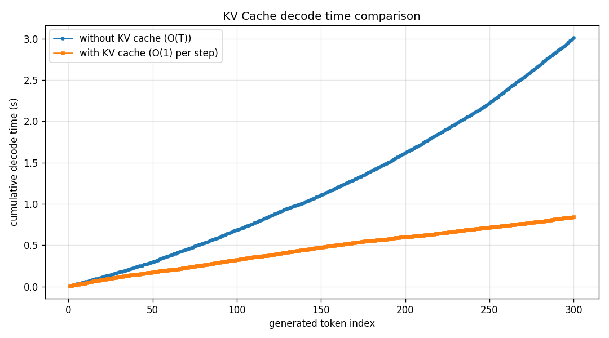
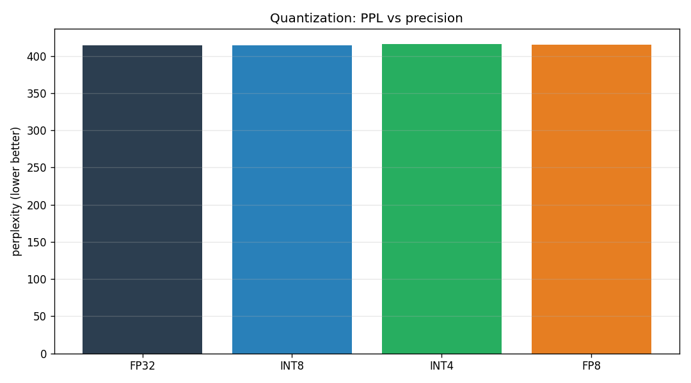
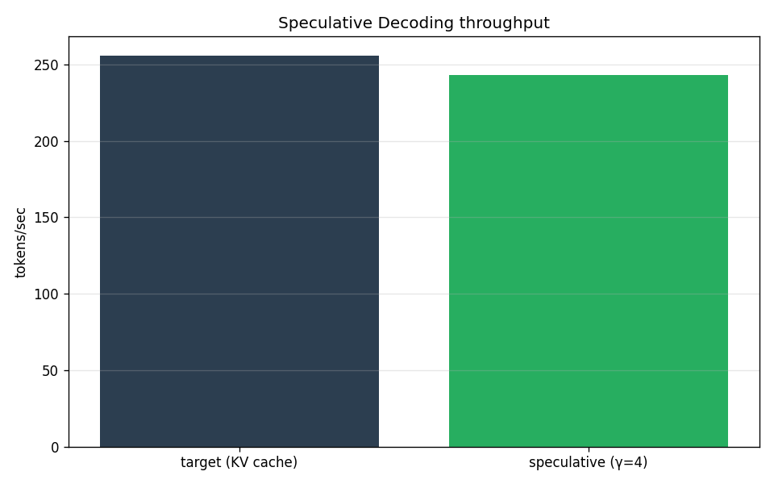
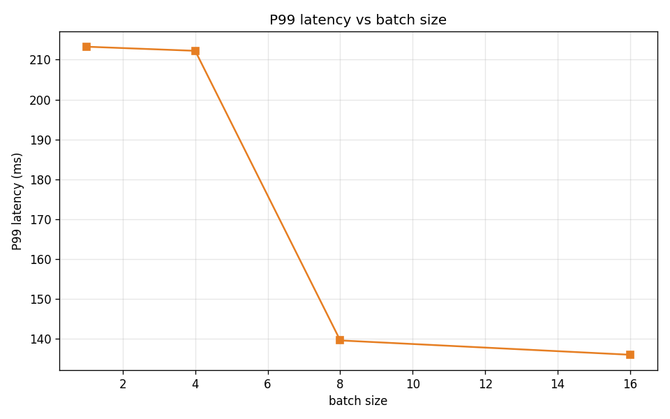
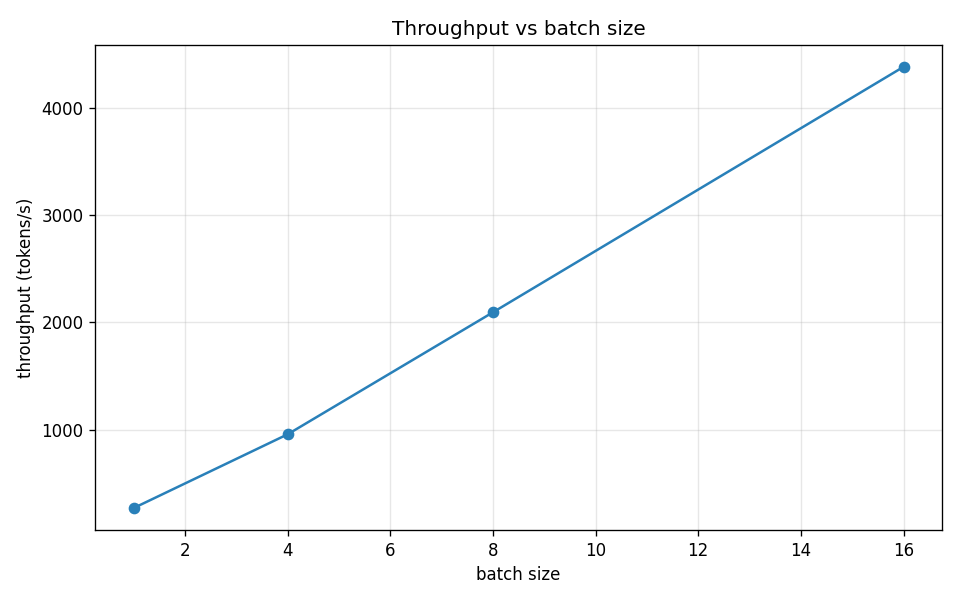
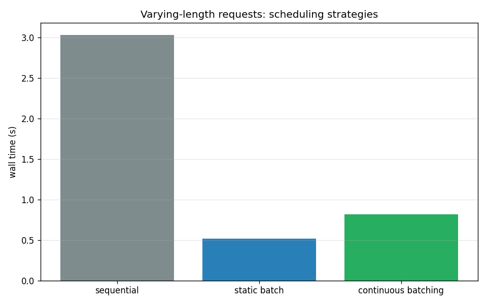

# LLM 推理优化

> 从零实现的 decoder-only GPT 上，覆盖 **KV Cache → 量化 → 投机解码 → 批量/连续批处理** 四步推理优化，每一步都有可复现的 benchmark 与结果报告。

本目录原本名为 `llm`，为便于理解更名为 **LLM推理优化**。所有代码依赖同一套极简 GPT（`gpt.py`），聚焦"算法层正确 + 可复现对比"的推理优化实践。

---

## 目录

1. [优化路线](#优化路线)
2. [目录结构](#目录结构)
3. [核心实现](#核心实现)
4. [Benchmark 结果速览](#benchmark-结果速览)
5. [快速开始](#快速开始)
6. [正确性保障](#正确性保障)
7. [Roadmap](#roadmap)
8. [文档与测试](#文档与测试)

---

## 优化路线

| Step | 层面 | 做法 | 关键结果 |
|------|------|------|----------|
| 1 | 解码复杂度 | **KV Cache** + prefill/decode | O(T²) → O(T)，实测 **~3.6×** |
| 2 | 权重精度 | **INT8/INT4/FP8 量化** | 存储压缩 4–5×，PPL 几乎无损失 |
| 3 | 采样算法 | **投机解码** | target 前向降到 0.2 次/token |
| 4 | 服务吞吐 | **批量解码 + continuous batching** | 吞吐随 batch 近线性增长 |

---

## 目录结构

```
LLM推理优化/
├── gpt.py              # decoder-only GPT（KV Cache / continuous batching）
├── train_utils.py      # 字符级 GPT 训练与评测工具
├── benchmark.py        # Step 1: KV Cache 解码加速对比
├── quantize.py         # Step 2: INT8/INT4/FP8 权重量化工具
├── quant_compare.py    # Step 2: 量化对比（PPL/存储/误差）
├── speculative.py      # Step 3: 投机解码（draft + 并行验证）
├── spec_bench.py       # Step 3: 投机解码吞吐基准
├── serving.py          # Step 4: 批量/并发解码引擎
├── serve_bench.py      # Step 4: serving 吞吐与延迟基准
├── continuous.py       # Step 4 进阶: 真·continuous batching（动态 slot 复用）
├── cont_bench.py       # Step 4 进阶: continuous batching 基准
├── __init__.py
├── tests/              # pytest 单测（正确性 + KV Cache 一致性）
├── docs/architecture.md # 架构说明
└── reports/            # 全部 benchmark 报告 + 图表
```

---

## 核心实现

### gpt.py —— 统一的 decoder-only GPT
简洁的因果 Transformer，作为所有推理优化实验的基座：
- 支持 **KV Cache**（prefill 一次性处理 prompt，decode 每步 O(1) 计算 K/V 查询）
- 支持 **continuous batching**（动态 slot 复用，见 `continuous.py`）
- 参数可配置：`n_layer` / `n_head` / `n_embd` / `block_size`

### Step 1 · KV Cache（`benchmark.py`）
对比"无缓存每步重算全部历史注意力（O(T)）"与"缓存 K/V 后每步只处理 1 个新 token（O(1)）"。

### Step 2 · 量化（`quantize.py` / `quant_compare.py`）
- 支持 FP32 / INT8 / INT4 / FP8 多种精度
- 对比指标：**存储占用、权重复原误差、logit 偏差、困惑度（PPL）**

### Step 3 · 投机解码（`speculative.py` / `spec_bench.py`）
- 用更小的 draft 模型一次性预测 γ 个候选 token，target 模型并行验证
- 拒绝采样保证输出与 target 一致（draft==target 时逐字一致）

### Step 4 · 批量/连续批处理（`serving.py` / `continuous.py`）
- `serving.py`：固定 batch 的并发解码引擎
- `continuous.py`：真·continuous batching，动态分配/回收 slot，消除 padding 浪费

---

## Benchmark 结果速览

所有完整报告与图表在 `reports/`。

| 优化 | 场景 | 结果 |
|------|------|------|
| **KV Cache** | CPU, prompt 128 / 生成 300 | 解码总耗时 3.01s → 0.84s，**3.57×** |
| **KV Cache** | GPU A800, 891K 小模型, 64→128 | 0.43s → 0.59s，**0.73×（负优化）** |
| **量化** | FP32 vs INT8/INT4/FP8 | 存储压缩 4–5×，PPL 均 ≈414 几乎不变 |
| **投机解码** | γ=4, 96 token | target 前向 1.0 → **0.20 次/token**（≈5× 计算量下降） |
| **批量解码** | batch 1→16 | 吞吐 269 → 4379 tokens/s |
| **continuous batching** | 64 请求 | 吞吐 342 → 1271 tokens/s（vs 串行 ~4×） |

> 各报告细节见 `reports/*.md`：`kv_cache_report.md`、`quant_compare_report.md`、`spec_report.md`、`serving_report.md`、`cont_report.md`。

### 📊 Benchmark 图表（`reports/`）

**KV Cache 解码耗时对比**（图为 CPU 基线 3.57×；GPU 实测 0.73× 见 [`kv_cache_report.md`](reports/kv_cache_report.md)）


**量化对比**（FP32 / INT8 / INT4 / FP8 的存储与 PPL）


**投机解码**（draft 预生成 γ 个候选，target 并行验证）


**批量 serving 延迟**


**批量 serving 吞吐**


**continuous batching**


> ⚠️ **诚实说明（KV Cache 的 GPU 反例）**：KV Cache 的复杂度优势（O(T)→O(1)）在 **CPU / 长序列 / 大模型** 等"重算代价高"的场景才兑现（CPU 下 3.57×）；但本次在 **A800 GPU + 891K 小模型 + 短序列（64→128）** 实测**反而更慢（0.73×）**——GPU 并行重算很快，而 KV Cache 的显存读写 / 索引开销反超重算收益。这提醒我们：**优化需结合硬件与规模评估，而非盲目套用**。详见 [`reports/kv_cache_report.md`](reports/kv_cache_report.md)。

---

## 快速开始

```bash
# 训练一个字符级 GPT（供实验复用）
python train_utils.py

# Step 1: KV Cache 加速对比
python benchmark.py

# Step 2: 量化对比
python quant_compare.py

# Step 3: 投机解码吞吐
python spec_bench.py

# Step 4: 批量 serving
python serve_bench.py

# Step 4 进阶: continuous batching
python cont_bench.py
```

---

## 正确性保障

每个优化在"快"之前先保证"对"：
- **KV / 非 KV** 生成 token 逐字一致
- **量化** 记录还原误差与 logit 偏差
- **投机解码** draft==target 时输出完全一致（拒绝采样）
- **continuous batching** 输出与逐条解码完全一致

---

## 文档与测试

- **架构说明**：[`docs/architecture.md`](docs/architecture.md)（模块职责 + 优化主线 + 基准入口）。
- **单元测试**（仅依赖 numpy/torch，无需 GPU）：
  ```bash
  pip install -e "LLM推理优化[dev]"
  pytest LLM推理优化/tests
  ```
  覆盖：GPT 前向形状、**KV Cache 与无缓存生成逐字一致**、`quantize_weight_tensor` 各精度的存储/误差。

## Roadmap

- [x] KV Cache → 量化 → 投机解码 → 批量/连续批处理
- [ ] PagedAttention（按块 KV 分配，省显存）
- [ ] 融合算子（GPU 上的 Marlin / FlashAttention / Triton）
- [ ] weight-only INT8/INT4 量化真实算子加速
