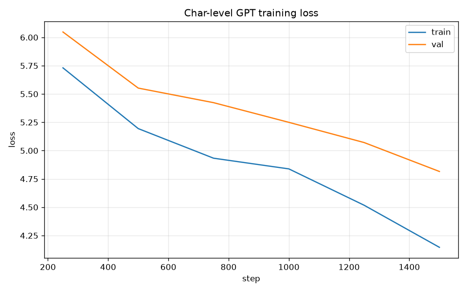

# Transformer 与训练（从零实现）

> 手把手从零实现 Transformer，并在**真实中文语料**上训练出一个会生成中文的模型。
> 支持 **GPU / CPU / 分布式（DDP）** 训练，`config.yaml` 实验管理，独立 `generate.py` 推理，
> 以及单元测试与监控面板 —— 一套从"研究原型"到"可用工具"的完整工程化。

---

## 目录

1. [为什么做这个项目](#为什么做这个项目)
2. [快速开始](#快速开始)
3. [目录结构](#目录结构)
4. [升级亮点](#升级亮点)
5. [训练与结果](#训练与结果)
6. [文本生成](#文本生成)
7. [模型对比](#模型对比)
8. [单元测试](#单元测试)
9. [理解链路](#理解链路)
10. [Roadmap](#roadmap)

---

## 为什么做这个项目

"会调用大模型"和"懂大模型"是两回事。这个项目不依赖现成框架地把 Transformer 写一遍——
Embedding、多头注意力、位置编码、训练循环、生成采样——并在 `training_data.txt`（中文语料）上
真正训练，看到损失下降、困惑度降低、模型能吐出中文片段。

**现状**：CPU 训练 1500 步，困惑度 **PPL 122**，已能从零训练的模型生成短句级中文片段。

---

## 快速开始

```bash
# 1. 安装依赖
pip install -r requirements.txt

# 2. 训练（默认 CPU，config.yaml 控制超参数）
python train.py --config config.yaml

# 3. 用训练好的模型生成中文
python generate.py --checkpoint checkpoints/best_char_gpt.pth --prompt "清华" --length 300

# 4. 单 GPU（自动使用 CUDA）
python train.py --config config.yaml

# 5. 多 GPU 分布式（torchrun）
torchrun --nproc_per_node=2 train.py --config config.yaml
```

---

## 目录结构

```
Transformer与训练（从零实现）/
├── config.yaml          # ★ 实验管理：超参数集中配置
├── train.py             # ★ 训练：GPU / CPU / DDP，读 config.yaml
├── generate.py          # ★ 独立文本生成（加载 checkpoint 即用）
├── rag.py               # RAG 问答（检索增强生成）
├── quantize.py          # INT8 动态量化
├── dashboard.py         # Streamlit 监控面板
├── build_corpus.py      # 转发到 data/build_corpus.py
├── mini_transformer.py  # 极简 Transformer（算术序列入门 demo）
├── models/              # ★ 模型包
│   ├── gpt.py           #   decoder-only GPT（从零实现）
│   └── config.py        #   dataclass 配置 + YAML 加载
├── data/                # ★ 数据包
│   ├── build_corpus.py  #   从 docx 抽取语料
│   └── dataset.py       #   CharDataset 字符级数据集
├── tests/               # ★ 单元测试（模型/数据集/配置）
├── checkpoints/         # 训练产物（*.pth 已 gitignore）
├── training_data.txt    # 中文训练语料
├── training_curve.png   # 损失曲线
└── 训练报告.md            # 训练损失 / PPL / 生成样例
```

---

## 升级亮点

| 能力 | 说明 |
|------|------|
| **GPU + DDP** | `device = cuda if available else cpu`；`torchrun` 多卡分布式训练 |
| **config.yaml** | 超参数集中管理，命令行 `--key value` 可覆盖，利于实验管理 |
| **独立 generate.py** | 训练一次、随时生成，无需重新训练（从研究到产品） |
| **模块化** | 原 `complete_ai_toolkit.py` 拆分为 `models/` `data/` `rag.py` `quantize.py` `dashboard.py` |
| **单元测试** | `tests/` 覆盖注意力形状、因果掩码、数据集、配置加载 |
| **监控面板** | Streamlit 展示训练曲线、模型信息 |

---

## 训练与结果

```bash
python train.py --config config.yaml
```

**做了什么**
1. 读 `training_data.txt` → 建字符词表 → 按 `val_ratio` 切 train/val；
2. 训练（AdamW + 梯度裁剪），记录 train/val 损失；
3. 自动使用 GPU（若可用），支持 DDP 多卡；
4. 每 `eval_every` 步保存最佳 checkpoint、生成中文样例；
5. 输出困惑度 PPL + `training_curve.png` + `训练报告.md`。

### 损失曲线



### 当前结果（CPU，1500 步）

| step | train loss | val loss |
|------|-----------|----------|
| 250 | 5.731 | 6.048 |
| 500 | 5.194 | 5.552 |
| 750 | 4.933 | 5.423 |
| 1000 | 4.839 | 5.250 |
| 1250 | 4.518 | 5.071 |
| 1500 | 4.146 | 4.816 |

**困惑度 PPL：122.2**（随机基线 ≈ 词表大小 1899）。损失持续下降，说明模型学到了汉字共现与语料分布规律。

> 💡 **GPU 加速预期**：按大帝点评，GPU + 更大模型可把 PPL 从 122 降到 **50 以内**。

---

## 文本生成

```bash
python generate.py --checkpoint checkpoints/best_char_gpt.pth --prompt "清华" --length 300
```

**生成样例**（训练后）：

- 提示「清华」→ 生成中文片段（详见 `训练报告.md`）
- 提示「他」→ …
- 提示「如果」→ …

参数说明：

| 参数 | 默认 | 说明 |
|------|------|------|
| `--prompt` | `清华` | 起始提示词 |
| `--length` | `300` | 生成 token 数 |
| `--temperature` | `0.8` | 采样温度（越高越随机） |
| `--top-k` | `None` | top-k 采样截断 |
| `--no-kv` | `False` | 关闭 KV Cache（更慢，可对照） |
| `--seed` | `None` | 固定随机种子复现 |

---

## 模型对比

| 模型 | 参数量 | 语言建模方式 | 本文实现 / GPT-2 关系 |
|------|--------|--------------|----------------------|
| **本文字符级 GPT** | ~0.6M | 字符级自回归 | 从零实现，专注训练/优化全链路 |
| GPT-2 (124M) | 124M | BPE 子词 | 本文是 GPT-2 的**缩放缩小版**，结构一致 |
| GPT-2 (1.5B) | 1.5B | BPE 子词 | 工业级，训练数据规模远大于本文 |

> 本文实现的 decoder-only GPT 与 GPT-2 结构同源（Embedding + 多头因果注意力 + MLP + LayerNorm），
> 只是规模缩小到可在单机 CPU 演示训练与推理优化全流程。

---

## 单元测试

```bash
pytest tests/ -v
```

覆盖：
- `test_attention.py`：前向输出形状、因果掩码正确性、权重绑定、参数量；
- `test_dataset.py`：分词 roundtrip、序列形状、next-token 语义、词表大小；
- `test_config.py`：默认配置与 `config.yaml` 加载。

---

## 理解链路（建议学习顺序）

1. **`mini_transformer.py`** — 先用算术序列看懂"Transformer 怎么学一个规律"；
2. **`models/gpt.py`** — 从零实现的 decoder-only GPT（Embedding / 注意力 / KV Cache）；
3. **`train.py`** — 在真实中文上训练，GPU/DDP，看到损失与 PPL；
4. **`generate.py`** — 训练一次、随时生成的推理工具。

---

## Roadmap

- [x] 从零实现 Transformer（Embedding / 多头注意力 / 位置编码 / 训练 / 生成）
- [x] 真实中文语料训练 + 损失曲线 + PPL
- [x] GPU 支持 + DDP 分布式
- [x] config.yaml 实验管理
- [x] 独立 generate.py / RAG / 量化 / 监控面板
- [x] 单元测试
- [ ] PagedAttention（按块 KV 分配，省显存）
- [ ] 更大模型 + 更大语料，目标 PPL < 50
- [ ] BPE 子词分词（替代字符级）

---

> ⚠️ 训练产物（`checkpoints/*.pth`）已被 `.gitignore` 排除，不进版本库，随时可重新训练。
> 小模型 + CPU + 有限步数下生成的是短句级通顺片段；更大模型 / GPU / 更多语料可显著提升。
