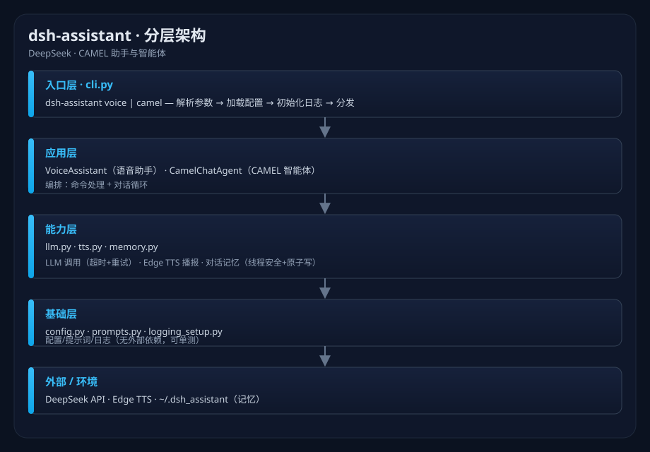

# 🎓 dsh-assistant · DeepSeek · CAMEL 助手与智能体

> 一套基于 **DeepSeek API** 的助手/智能体集合：可复用的 **语音助手**（DeepSeek + Edge TTS）与 **CAMEL 多智能体对话**，封装为规范的 Python 包，提供统一 CLI 与库接口。

**状态**：活跃开发 · **语言**：Python 3.9+ · **许可**：MIT · **模型**：DeepSeek（OpenAI 兼容）

---

## 目录

- [简介](#简介)
- [特性](#特性)
- [快速开始](#快速开始)
- [配置](#配置)
- [CLI 参考](#cli-参考)
- [作为库使用](#作为库使用)
- [项目结构](#项目结构)
- [开发](#开发)
- [许可](#许可)
- [安全说明](#安全说明)
- [文档](docs/README.md)

---

## 简介

本项目把两个"助手/智能体"场景做成**结构化、可复用、可测试**的包：

| 模块 | 说明 |
|---|---|
| **语音助手** | DeepSeek 生成回复，Edge TTS 中文女声播报，对话记忆持久化、命令系统、按时问候 |
| **CAMEL 智能体** | 基于 CAMEL 框架 + DeepSeek 的角色化对话智能体，带显式上下文历史与命令 |

> 📈 分层架构见 [docs/architecture.md](docs/architecture.md)，示意图如下：



## 特性

- **统一配置**：`.env` / 环境变量管理，密钥从环境读取，绝不硬编码或入库；
- **结构化日志**：标准 `logging`，统一格式与级别；
- **健壮的 LLM 调用**：超时 + **指数退避重试**，失败给出可读信息；
- **持久化记忆**：线程安全 + 原子写 JSON，自动裁剪与清空；
- **命令系统**：`/help` `/clear` `/history` `/quit`；
- **多端入口**：CLI 子命令 + 可直接作为库调用；
- **可测试**：配置 / 记忆 / 提示词均有单元测试，不依赖网络与第三方模型。
- **可选 CAMEL**：`camel-ai` 为重量依赖，懒加载，未安装仅影响对应子命令。

## 快速开始

```bash
# 1) 配置密钥
cp .env.example .env         # 填入 DEEPSEEK_API_KEY

# 2) 安装
pip install -e .             # 或 pip install -r requirements.txt

# 3) 运行
dsh-assistant voice          # 语音助手（DeepSeek + Edge TTS）
dsh-assistant camel          # CAMEL 对话智能体
```

> 需要 `camel-ai` 时：`pip install -e ".[camel]"`。

## 配置

本项目从 `.env` 或环境变量读取配置（见 `.env.example`）：

| 变量 | 默认 | 说明 |
|---|---|---|
| `DEEPSEEK_API_KEY` | — | **必填**，DeepSeek API Key |
| `DEEPSEEK_BASE_URL` | `https://api.deepseek.com` | API 地址 |
| `DSH_MODEL` | `deepseek-chat` | 模型名 |
| `DSH_TEMPERATURE` | `0.7` | 采样温度 |
| `DSH_VOICE` | `zh-CN-YunxiNeural` | Edge TTS 音色 |
| `DSH_SPEAK` | `1` | 语音播报开关 |
| `DSH_MAX_ROUNDS` | `20` | 记忆保留轮数 |
| `DSH_LOG_LEVEL` | `INFO` | 日志级别 |
| `DSH_DATA_DIR` | `~/.dsh_assistant` | 记忆/数据目录 |

## CLI 参考

```bash
dsh-assistant voice [--no-speak] [--history-file PATH]
dsh-assistant camel [--user NAME]
```

| 选项 | 说明 |
|---|---|
| `voice --no-speak` | 关闭 TTS 播报 |
| `voice --history-file` | 覆盖记忆文件路径 |
| `camel --user` | 覆盖用户称呼 |

交互命令：`/help` 帮助 · `/clear` 清空记忆 · `/history` 最近对话 · `/quit` 退出。

## 作为库使用

```python
from dsh_assistant.config import Settings
from dsh_assistant.assistant import VoiceAssistant
from dsh_assistant.camel_agent import CamelChatAgent

settings = Settings.from_env()
settings.validate()

# 语音助手
va = VoiceAssistant(settings)
print(va.greet())
print(va.chat("今天有什么值得开心的事？"))

# CAMEL 智能体
agent = CamelChatAgent(settings)
print(agent.chat("给我讲个关于代码的笑话。"))
```

## 项目结构

```
助手与智能体（DeepSeek·CAMEL）/
├── README.md
├── LICENSE
├── pyproject.toml             # 包元数据 / 依赖 / ruff / mypy / pytest / 入口
├── requirements.txt
├── .env.example               # 配置模板
├── .gitignore                 # 忽略 .env / data / 产物
├── .editorconfig
├── .github/workflows/ci.yml   # CI：lint + test + compile
├── src/dsh_assistant/
│   ├── __init__.py
│   ├── config.py              # Settings + .env 加载 + 校验
│   ├── prompts.py             # 提示词常量
│   ├── logging_setup.py       # 日志初始化
│   ├── llm.py                 # LLM 客户端（重试/超时）
│   ├── tts.py                 # Edge TTS 引擎
│   ├── memory.py              # 对话记忆（线程安全 + 原子写）
│   ├── camel_agent.py         # CAMEL 智能体
│   ├── assistant.py           # 语音助手（组合）
│   └── cli.py                 # 命令行入口
├── tests/                     # 单元测试（无网络/无模型）
├── docs/                      # 文档（架构 / API / 设计决策）
└── examples/                  # 原始独立脚本（参考）
```

## 开发

```bash
pip install -e ".[dev]"        # pytest / ruff / mypy

pytest -q                      # 运行测试
ruff check src tests           # 静态检查
mypy src                       # 类型检查
```

CI（`.github/workflows/ci.yml`）自动跑：单测 + 编译检查 + ruff。

## 许可

MIT（见 [`LICENSE`](LICENSE)）。

## 安全说明

- 密钥仅从环境变量/`.env` 读取；`.env` 已被 `.gitignore` 排除，**不要**把 Key 提交进仓库；
- 涉及网络调用与语音播放，请在可接受的网络/音频环境使用；
- 项目仅用于个人与教学用途，请遵守 DeepSeek 的 API 使用条款。
