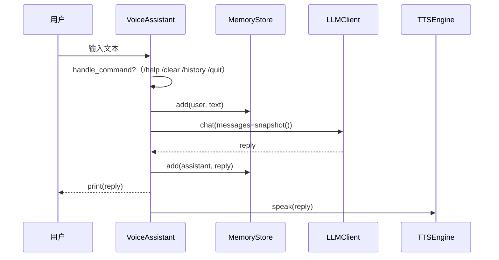

# 🏗️ 架构


> 浅色版：[`architecture-light.svg`](./images/architecture-light.svg)

## 分层

```text
┌───────────────────────────────────────────────────────────┐
│  入口层  cli.py  (dsh-assistant voice|camel|agent|web)     │
│  解析参数 → 加载配置 → 初始化日志 → 分发到具体助手           │
├───────────────────────────────────────────────────────────┤
│  应用层  assistant.py · camel_agent.py · agentic.py        │
│  编排：命令处理 + 对话循环 + ReAct 工具智能体                │
├───────────────────────────────────────────────────────────┤
│  能力层  llm.py · tts.py · memory.py · tools.py            │
│  LLM 调用(流式/工具) · 语音播报 · 记忆持久化 · 工具注册表     │
├───────────────────────────────────────────────────────────┤
│  Web 层  web.py · web/index.html                           │
│  FastAPI + SSE 流式 + 玻璃拟态前端（多模型/多操作）          │
├───────────────────────────────────────────────────────────┤
│  基础层  config.py · prompts.py · logging_setup.py          │
│  配置/提示词/日志（无外部依赖）                              │
└───────────────────────────────────────────────────────────┘
```

## 模块职责

| 模块 | 职责 | 外部依赖 |
|---|---|---|
| `config.py` | 集中配置、`.env` 加载、校验 | python-dotenv |
| `prompts.py` | 系统提示词常量 | 无 |
| `logging_setup.py` | 日志初始化 | 无 |
| `llm.py` | DeepSeek chat / stream / function-calling（超时+重试+model 覆盖） | openai（懒加载） |
| `tts.py` | Edge TTS 播报（后台线程） | edge-tts（懒加载） |
| `memory.py` | 记忆持久化（线程安全+原子写+覆盖） | 无 |
| `tools.py` | 确定性工具注册表（安全计算器/时钟/骰子） | 无 |
| `assistant.py` | 语音助手编排（流式 + /rewrite） | 无（组合上面的能力） |
| `camel_agent.py` | CAMEL 对话智能体（/rewrite） | camel-ai（懒加载） |
| `agentic.py` | 工具调用 ReAct 智能体 | 无 |
| `web.py` | FastAPI 后端（SSE 流式/多模型/重写/TTS） | fastapi+uvicorn（懒加载） |
| `cli.py` | 命令行入口（voice|camel|agent|web） | 无 |

## 数据流（语音助手一次对话）



```text
用户输入
   │  (input)
   ▼
assistant.run()
   │  cli/handle_command? ──是──▶ /help /clear /history /quit
   │  否
   ▼  chat(text)
memory.add("user", text)
   │
   ▼
llm.chat(memory.snapshot())   # system + 历史 + 本轮 user
   │  重试/超时
   ▼  返回 reply
memory.add("assistant", reply)
   │
   ▼
print(reply) · tts.speak(reply)
```

## 关键约定

- **密钥**：只从环境变量 / `.env` 读取，绝不硬编码（见 `config.Settings.validate`）。
- **依赖懒加载**：`openai` / `edge-tts` / `camel-ai` 均为可选，缺失只影响对应能力，`import dsh_assistant` 永远成功。
- **状态可持久化**：记忆落到 `~/.dsh_assistant`（可用 `DSH_DATA_DIR` 覆盖），不污染仓库。
