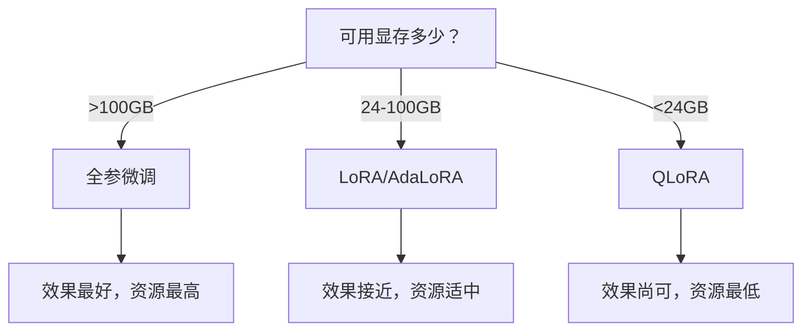
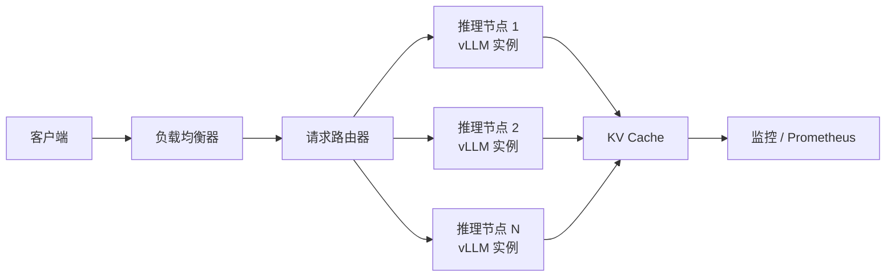

# 大模型全栈工程手册

---

## 第一部分：先决条件与基础设施

### 1.1 硬件选型：从公式到失效边界

#### 1.1.1 GPU 选型的帕累托矩阵

传统的决策树是"非黑即白"的静态选择。现实中，任何选择都是在多重约束下的妥协。我们引入**帕累托前沿（Pareto Frontier）**的概念，用矩阵形式呈现不同约束条件下的最优、次优和激进方案。

**表 1.0：GPU 选型的帕累托矩阵**

| 约束条件 | 首选方案（Pareto 最优） | 次优方案（牺牲什么） | 激进方案（赌什么） |
| :--- | :--- | :--- | :--- |
| 显存 < 24GB | QLoRA + 7B 模型 | INT4 GPTQ 推理（牺牲精度） | ZeRO-3 Offload（牺牲训练速度） |
| 预算有限但需训 70B | 4×A100 40GB + ZeRO-3 | 8×RTX 4090 + NVLink 桥接（牺牲稳定性） | 云 Spot 实例（牺牲训练连续性） |
| 追求最小首 Token 延迟 (TTFT) | TensorRT-LLM + INT8 | vLLM + PagedAttention（牺牲 5% 吞吐） | 推测解码（牺牲草稿模型显存） |

#### 1.1.2 显存速算与算力-显存权衡

**定义 1.1（模型加载显存）**：对于一个参数量为 $N$（单位：十亿）的模型，在推理阶段加载所需的显存量 $M_{\text{load}}$ 可由下式粗略估算：

$$
M_{\text{load}} \approx N \times b \times 1.2 \tag{1.1}
$$

其中，$b$ 是量化位数（FP16 为 2 字节，INT8 为 1 字节，INT4 为 0.5 字节）。系数 1.2 是一个工程经验值，主要覆盖**参数存储、梯度副本、优化器状态**等模型相关内存需求，而非一般意义上的"框架开销"（如 CUDA context、PyTorch allocator 元数据等）。这些额外开销通常为一个与模型规模弱相关的常数（约 1–3 GB），不随参数量严格线性增长。

> **注**：在 ZeRO-3 分布式训练中，每卡参数量降至 $N/G$（$G$ 为 GPU 数量），此时固定开销在总显存中的占比反而更大，式 (1.1) 的经验系数需相应下调。

**定理 1.1（算力-显存权衡）**：对于参数量为 $N$ 的自回归模型，其在解码阶段的**计算强度**（Computational Intensity, CI）约为 1 FLOP/byte。因此，推理延迟主要由显存带宽（Memory Bandwidth）而非计算峰值算力主导。

**证明**：在自回归解码过程中，每生成一个 Token 需要进行一次前向传播。该过程包含约 $2N$ 次浮点运算（FLOPs），同时需要从显存（HBM）中读取模型的所有 $2N$ 个字节的参数。因此，计算强度为：

$$
\text{CI} = \frac{\text{FLOPs}}{\text{Bytes}} \approx \frac{2N}{2N} = 1 \quad \text{FLOP/byte}
$$

以 A100 GPU 为例，其理论算力为 312 TFLOPS，但 HBM 带宽仅为 2 TB/s。在计算强度为 1 的限制下，实际能达到的有效吞吐量受限于带宽，约为 $2\ \text{TB/s} \times 1\ \text{FLOP/byte} = 2\ \text{TFLOPS}$，仅为理论峰值的 0.6%。

**推论 1.1**：优化推理性能的核心在于**降低对显存带宽的需求**。这可以通过模型量化、KV Cache 压缩等技术实现，而非单纯追求更高的计算算力。

#### 1.1.3 显存公式的失效边界：当系数 1.2 不再安全

式 (1.1) 中的系数 1.2 在以下场景中可能严重低估实际显存需求：

1. **长上下文训练**：当 $\text{seq\_len} > 4096$ 时，激活值（Activation）的显存占用开始超越模型参数本身。此时，总显存需求应修正为：

   $$
   M_{\text{total}} \approx N \times b \times 1.2 + 4 \times \text{batch} \times \text{seq\_len} \times \text{hidden\_dim} \times \text{num\_layers} \tag{1.2}
$$

2. **梯度检查点（Gradient Checkpointing）的代价**：该技术虽能节省显存，但会引入 $O(N)$ 的额外重计算开销，导致式 (1.1) 中的系数变为动态值，而非静态常数。

---

### 1.2 分布式训练框架：通信复杂度与真实瓶颈

#### 1.2.1 并行范式速查

**表 1.2：并行范式速查表**

| 范式 | 原理 | 通信量 | 适用场景 |
| :--- | :--- | :--- | :--- |
| 数据并行 (DP) | 每卡拥有完整模型副本，通过 AllReduce 同步梯度 | $4\psi$ | 模型可装入单卡 |
| 流水线并行 (PP) | 将模型的不同层分配到不同 GPU 上 | 单层激活值 | 模型层数很多 |
| 张量并行 (TP) | 将单层的计算切分到多个 GPU 上 | $2 \times$ 激活值/层 | 单层计算量巨大 |
| ZeRO-3 | 分割参数、梯度、优化器状态到所有 GPU | $4\psi$（同 DP） | 显存极度受限 |

> 注：$\psi$ 表示单卡上的梯度大小。

#### 1.2.2 通信复杂度分析与真实瓶颈

**定理 1.2（Ring All-Reduce 通信量）**：在 $G$ 个 GPU 上进行数据并行，使用 Ring All-Reduce 算法，每个 GPU 在 All-Reduce 过程中发送和接收的总字节数为：

$$
C_{\text{all-reduce}} = 2\psi \cdot \frac{G-1}{G} \tag{1.3}
$$

当 $G \to \infty$ 时，$C_{\text{all-reduce}} \to 2\psi$。这表明 Ring All-Reduce 的**总通信量**与参与计算的 GPU 数量无关，具有良好的可扩展性。

> **工程解读**：式 (1.3) 中 $(G-1)/G$ 因子在 $G$ 较大时趋近于 1，因此每个 GPU 的实际发送/接收总量**恒定在 $2\psi$**，不随 $G$ 增长。这是 Ring All-Reduce 的核心优势。

**深度补充：通信与计算的交织**：式 (1.3) 给出的是**理想网络**下的通信量。在实际集群中，关键瓶颈并非通信总量（Volume），而是**通信延迟（Latency）**和**网络拥塞**。

当 $G$ 超过一定阈值（例如 $> 64$）时，Ring All-Reduce 的延迟由 $(G-1) \times \text{单次传输延迟}$ 决定。此时，更优策略是采用 **Hierarchical All-Reduce**（先机内 NVLink 通信，再机间 InfiniBand 通信），其有效带宽是式 (1.3) 理论值的 $1/3$ 至 $1/2$。

**定理 1.3（ZeRO-3 显存下界）**：使用 ZeRO-3 策略在 $G$ 个 GPU 上训练一个参数量为 $N$ 的模型，每个 GPU 所需的最小显存（不计激活值）为：

$$
M_{\text{ZeRO-3}} = \frac{16N}{G} + O(\text{activation}) \tag{1.4}
$$

**示例**：训练 175B 参数的模型，使用 256 张 A100 80GB GPU。根据式 (1.4)，每卡用于存储模型状态的显存为 $16 \times 175\text{B} / 256 \approx 10.9\ \text{GB}$。再加上约 20–30 GB 的激活值，总显存需求约为 30–40 GB，远低于 80 GB 的单卡容量。

#### 1.2.3 框架对比与选型决策

**表 1.3：主流分布式框架对比**

| 特性 | DeepSpeed ZeRO-3 | FSDP | Megatron-LM |
| :--- | :--- | :--- |
| 生态 | 独立安装 | PyTorch 原生 | NVIDIA 维护 |
| TP 支持 | 有限 | 有限 | 最成熟 |
| CPU Offload | 最成熟 | 较新 | 不支持 |
| 推荐场景 | 极致性能 / 显存紧张 | 快速原型 / 新手 | 超大模型训练 |

### 1.3 数据管道：清洗、去重与配比

#### 1.3.1 数据清洗流程

```python
from datasets import load_dataset

dataset = load_dataset("json", data_files="raw_data.jsonl")

def quality_filter(example):
    text = example["text"]
    if len(text) < 100 or len(text) > 100000:
        return False
    if detect_language(text) != "en":
        return False
    special_ratio = sum(not c.isalnum() for c in text) / len(text)
    if special_ratio > 0.5:
        return False
    return True

clean_dataset = dataset.filter(quality_filter)
```

#### 1.3.2 去重策略与复杂度分析

**定理 1.4（MinHash 去重复杂度）**：对于 $N$ 篇文档，每篇生成 $k$ 个 MinHash 签名，并使用局部敏感哈希（LSH）进行近似去重，其期望的时间复杂度和空间复杂度分别为：

$$
T_{\text{MinHash}} = O(N \cdot k \cdot \log N), \quad S_{\text{MinHash}} = O(N \cdot k) \tag{1.5}
$$

相比于精确去重的 $O(N^2)$ 复杂度，在 $N = 10^9$ 时，MinHash 方法的计算量减少了约 $10^6$ 倍。

**边界与局限**：当文档平均长度小于 100 个字符时，MinHash 签名的信息熵过低，导致近似失效。在这种情况下，应回退到基于 SHA256 哈希的精确去重。

#### 1.3.3 数据配比黄金法则

**表 1.4：训练数据推荐配比**

| 数据类型 | 推荐占比 | 作用 |
| :--- | :--- | :--- |
| 通用语料 (C4/Wikipedia) | 60% | 基础语言能力 |
| 代码 (GitHub/The Stack) | 15% | 推理 / 逻辑能力 |
| 学术论文 (ArXiv) | 10% | 专业知识 |
| 对话 / 指令 | 10% | 对齐能力 |
| 多语言 | 5% | 跨语言泛化 |

---

## 第二部分：模型开发与调优

### 2.1 全参数微调 vs 参数高效微调 (PEFT)

#### 2.1.1 选型决策树



> **图 2.1：微调方法选型决策树**

#### 2.1.2 LoRA：理论与实践

**定义 2.1（低秩适应，LoRA）**：对于预训练权重矩阵 $W_0 \in \mathbb{R}^{d \times k}$，LoRA 通过引入一个低秩分解矩阵 $BA$ 来约束其更新，即：

$$
W = W_0 + BA, \quad \text{其中 } B \in \mathbb{R}^{d \times r},\ A \in \mathbb{R}^{r \times k},\ r \ll \min(d, k) \tag{2.1}
$$

**定理 2.1（LoRA 秩的下界）**：假设微调任务存在一个有效的低秩结构，其内在秩为 $r^*$。当 LoRA 的秩 $r < r^*$ 时，模型表达能力不足以拟合目标任务，性能随 $r$ 的增加而显著提升。当 $r \ge r^*$ 时，继续增大 $r$ 带来的边际收益递减，并可能因正则化效应减弱而导致过拟合。

> **关于"有效秩"的说明**：$r^*$ 并非模型本身的固有属性，而是**任务、数据分布与预训练模型三者耦合**产生的 emergent property，无法在训练前先验计算。定理 2.1 应理解为一种**经验性指导原则**而非可精确量化的定理。

**实践判据**：在验证集上监控 Loss。当 $r$ 从 4 → 8 → 16 → 32 递增时，若 Loss 下降幅度逐级减半，则可认为当前 $r^*$ 位于上一级附近。**注意**：该判据应结合**下游任务指标**综合判断，避免过度依赖验证集 Loss 导致过拟合。

**定理 2.2（LoRA 与全参微调的性能差距）**：对于参数量为 $N$ 的模型，LoRA 的可训练参数量为 $N \cdot (r/d + r/k)$。当 $r = 8$ 时，该比例约为 0.1% 至 1%。理论分析表明，当微调任务的分布与预训练分布的 Hellinger 距离 $D_H < 0.3$ 时，LoRA 的性能可达到全参微调的 98% 以上；当 $D_H > 0.5$ 时，性能差距会扩大到 5–10%。

**LoRA 实战代码（3 行核心）**：

```python
from peft import LoraConfig, get_peft_model

config = LoraConfig(r=8, target_modules=["q_proj", "v_proj"], lora_alpha=32, lora_dropout=0.05)
model = get_peft_model(base_model, config)
model.train()
```

#### 2.1.3 QLoRA：极限显存下的微调

QLoRA 通过三项关键技术，实现了在 24GB 显存下微调 33B 模型：

1. **NF4 量化**：一种适配正态分布权重的 4-bit 量化格式，精度高于普通 INT4。
2. **双重量化**：对量化常数再次进行量化，进一步节省约 0.5 bit/参数。
3. **分页优化器**：利用 CPU 内存作为优化器状态的溢出缓冲区。

```python
from transformers import BitsAndBytesConfig

bnb_config = BitsAndBytesConfig(
    load_in_4bit=True,
    bnb_4bit_use_double_quant=True,
    bnb_4bit_quant_type="nf4",
    bnb_4bit_compute_dtype=torch.bfloat16
)
model = AutoModelForCausalLM.from_pretrained(
    "meta-llama/Llama-2-7b-hf",
    quantization_config=bnb_config,
    device_map="auto"
)
```

**表 2.1：不同微调方法的效果与资源对比（以 7B 模型为例）**

| 方法 | 可训参数量 | 显存需求（不计激活值） | 相对效果 |
| :--- | :--- | :--- | :--- |
| 全参微调 | 7B | ~56 GB（实际建议预留 60–70 GB） | 100% |
| LoRA ($r=8$) | 4.2M[^1] | ~28 GB | 98–99% |
| QLoRA (4-bit) | 4.2M | ~12 GB | 96–98% |

> **说明**：全参微调的 ~56 GB 包含模型参数（14 GB, FP16）、梯度（14 GB）和优化器状态（Adam, 28 GB）。此值未计入激活值（batch size = 1, seq_len = 2048 时约 2–4 GB）。工程中建议预留 **20% 余量**，即实际需 60–70 GB。
>
> [^1]: 以 LLaMA-7B (hidden_size=4096) 为例，仅对 q_proj 和 v_proj 应用 LoRA 时约为 4.2M；不同模型的 hidden_size 不同，该数值会相应变化。

---

### 2.2 训练稳定性：优化理论与收敛性

#### 2.2.1 混合精度选择

**表 2.2：混合精度选择指南**

| 精度 | 动态范围 | 是否易溢出 | 推荐场景 |
| :--- | :--- | :--- | :--- |
| FP32 | 大 | 否 | 基线 / 调试 |
| FP16 | 中 | 是 | 老显卡 |
| BF16 | 大 | 否 | 首选 (A100 / H100) |

#### 2.2.2 学习率调度

标准的"预热 + 余弦退火"学习率调度策略如下所示：

```python
scheduler = torch.optim.lr_scheduler.SequentialLR(
    optimizer,
    schedulers=[
        torch.optim.lr_scheduler.LinearLR(optimizer, start_factor=0.01, total_iters=1000),
        torch.optim.lr_scheduler.CosineAnnealingLR(optimizer, T_max=10000)
    ],
    milestones=[1000]
)
```

#### 2.2.3 梯度裁剪与收敛性

**定理 2.3（梯度裁剪的收敛性）**：假设损失函数 $L$ 满足 $L$-光滑条件，即存在常数 $L > 0$ 使得 $\| \nabla L(x) - \nabla L(y) \| \le L \| x - y \|$。设梯度裁剪的阈值为 $C$。在经过 $T$ 次迭代后，梯度范数的平方的期望满足：

$$
\mathbb{E}\bigl[ \| \nabla L(\theta_T) \|^2 \bigr] \le O\!\left(\frac{1}{\sqrt{T}}\right) + O\!\left(\frac{C}{T}\right) \tag{2.2}
$$

**推论 2.1**：梯度裁剪操作不会改变算法的收敛阶数 $O(1/\sqrt{T})$，但由于裁剪会丢失部分梯度信息，会导致最终的收敛精度有所牺牲。

**边界与局限**：当裁剪阈值 $C$ 设置得过小（例如 $C < 0.1$）时，梯度方向会被严重扭曲，导致模型收敛到非平稳点。在实践中，$C$ 通常设置在 0.5 到 2.0 之间。

**梯度裁剪与累积代码**：

```python
# 梯度裁剪（防止梯度爆炸）
torch.nn.utils.clip_grad_norm_(model.parameters(), max_norm=1.0)

# 梯度累积（等效增大 batch size）
accumulation_steps = 4
loss = loss / accumulation_steps
loss.backward()
if (step + 1) % accumulation_steps == 0:
    optimizer.step()
    optimizer.zero_grad()
```

---

### 2.3 数据配比与课程学习

**动态采样策略**：

```python
data_sources = {
    "c4":        {"path": "c4/train",        "weight": 0.6},
    "code":      {"path": "code/train",      "weight": 0.15},
    "arxiv":     {"path": "arxiv/train",     "weight": 0.1},
    "chat":      {"path": "chat/train",      "weight": 0.1},
    "multilingual": {"path": "multi/train", "weight": 0.05}
}

source_names = list(data_sources.keys())
weights = [data_sources[s]["weight"] for s in source_names]

for batch in range(total_batches):
    source = np.random.choice(source_names, p=weights)
    data = load_batch(data_sources[source]["path"])
    # ... 训练逻辑
```

---

### 2.4 超参数调优的系统化方法

#### 2.4.1 从网格搜索到贝叶斯优化

**表 2.3：超参数搜索方法对比**

| 方法 | 适用阶段 | 优点 | 缺点 |
| :--- | :--- | :--- | :--- |
| 网格搜索 | 小模型 ($< 1$B) | 可并行、可复现 | 维度诅咒 |
| 随机搜索 | 中等模型 | 比网格搜索效率高 | 依然盲目 |
| **贝叶斯优化** | 大模型 | 利用历史评估结果，采样效率最高 | 实现复杂 |
| **Hyperband / ASHA** | 超大规模 | 早停法，节省 90% 算力 | 需定义中间指标 |

#### 2.4.2 关键超参数的"稳定性区间"

**表 2.4：关键超参数稳定区间与临界行为**

| 超参数 | 稳定区间 | 临界行为（超出后） |
| :--- | :--- | :--- |
| 学习率 (1B 模型) | $[3 \times 10^{-4},\ 5 \times 10^{-4}]$ | $> 10^{-3}$ → 梯度爆炸；$< 10^{-5}$ → 几乎不收敛 |
| 权重衰减 | $[0.01,\ 0.1]$ | $> 0.5$ → 模型欠拟合；$< 0.001$ → 过拟合 |
| 梯度裁剪阈值 | $[0.5,\ 2.0]$ | $< 0.1$ → 信息丢失；$> 5$ → 裁剪失效 |
| Batch Size | $[2^{14},\ 2^{20}]$ tokens | 超出后，需同步调整学习率（线性缩放法则） |

---

## 第三部分：推理与部署上线

### 3.1 推理加速核心技术

#### 3.1.1 KV Cache 与 FlashAttention

**KV Cache**：在自回归生成中，缓存已计算的历史 Key 和 Value 矩阵，避免在每个解码步骤重复计算，从而大幅降低计算量和延迟。

**定理 3.1（FlashAttention 的数值等价性）**：FlashAttention 在数学上与标准注意力机制完全等价。在 FP16 浮点运算中，由于累加顺序不同，会引入 $< 1 \times 10^{-3}$ 的相对误差，通常不影响最终结果。

**证明要点**：FlashAttention 通过在线维护一个 running maximum ($m$) 和一个 running sum ($l$)，使得分块计算的结果能够通过重新缩放操作，与全局 Softmax 归一化的结果保持一致。此过程在数学上是精确的；在浮点运算中，由于不同累加顺序导致的舍入误差，数值结果会有微小差异（通常 $< 1\times10^{-3}$），属于可忽略范围。

**定理 3.2（FlashAttention 的 HBM 访问量）**：设片上 SRAM 的大小为 $M$，序列长度为 $N$，注意力头维度为 $d$。FlashAttention 在执行一次注意力计算时，对高带宽显存（HBM）的访问量为：

$$
C_{\text{HBM}} = O\!\left(\frac{N^2 d}{M}\right) \tag{3.1}
$$

当 $M \approx 20\ \text{MB}$ 时，与标准注意力的 $O(N^2 + Nd)$ 相比，在 $N = 8\text{K}$ 时可减少约 10 倍的 HBM 访问。

**收敛性**：由于 FlashAttention 的计算图与标准注意力完全相同，因此在训练过程中，两者的收敛轨迹一致，不会影响模型的最终性能。

**使用 FlashAttention（一行代码开启）**：

```python
model = AutoModelForCausalLM.from_pretrained(
    "meta-llama/Llama-2-7b-hf",
    attn_implementation="flash_attention_2",
    torch_dtype=torch.bfloat16
)
```

#### 3.1.2 PagedAttention

**PagedAttention**：受虚拟内存管理启发，将 KV Cache 划分为固定大小的"页"，允许非连续的物理显存存储，从而消除内部碎片，提高显存利用率。这是 vLLM 框架的核心创新，可将吞吐量提升 10–15 倍。

---

### 3.2 模型量化：原理与误差分析

#### 3.2.1 量化速算表

**表 3.1：不同量化方式对 70B 模型的影响**

| 量化方式 | 70B 模型显存 | 速度提升 | 精度损失 (PPL) |
| :--- | :--- | :--- | :--- |
| FP16 | 140 GB | 1× | 0 |
| INT8 | 70 GB | 1.5–2× | < 0.1 |
| INT4 (GPTQ) | 35 GB | 2–3× | 0.5–1.0 |
| INT4 (AWQ) | 35 GB | 2–3× | 0.3–0.8 |

#### 3.2.2 量化误差界

**定理 3.3（均匀量化误差界）**：对于一个取值范围在 $[\min,\ \max]$ 内的权重 $w$，对其进行 $b$ 位均匀量化，得到的量化值 $w'$ 满足逐元素无穷范数误差上界：

$$
\| w - w' \|_\infty \le \frac{\max - \min}{2^{b+1}} \tag{3.2}
$$

INT8 量化步长为 FP16 表示范围的 $1/256$，因此逐元素误差显著小于 FP16 自身的舍入误差，通常可以忽略；INT4 量化步长为 $1/16$，误差相对较大但仍处于可接受范围。

**定理 3.4（GPTQ 的 Hessian 补偿）**：GPTQ 在对权重矩阵的第 $i$ 列进行量化时，会对剩余的未量化列进行最优补偿。该补偿量 $\delta$ 由下式给出：

$$
\delta = -\frac{w_i - q_i}{(H^{-1})_{ii}} \cdot (H^{-1})_{:,\ i} \tag{3.3}
$$

其中，$H$ 是损失函数关于权重的 Hessian 矩阵。该补偿保证了在二阶泰勒展开意义下，量化误差被最小化。

**边界与局限**：当 Hessian 矩阵的条件数大于 $10^4$ 时，GPTQ 的补偿效果会显著衰减。在这种情况下，应优先选择 AWQ 这类基于激活感知的量化方法。

#### 3.2.3 显存计算公式

总显存需求由三部分组成：

$$
M_{\text{total}} = M_{\text{param}} + M_{\text{KV cache}} + M_{\text{activations}} \tag{3.4}
$$

其中，

$$
M_{\text{param}} = N \times b
$$

$$
M_{\text{KV cache}} = 2 \times \text{batch\_size} \times \text{seq\_len} \times \text{num\_layers} \times \text{hidden\_dim} \times b
$$

**示例**：70B 模型，INT4 量化，batch = 1，seq\_len = 4096。

- $M_{\text{param}} = 70\text{B} \times 0.5\text{B} = 35\ \text{GB}$
- $M_{\text{KV cache}} = 2 \times 1 \times 4096 \times 80 \times 8192 \times 2\text{B} \approx 10.7\ \text{GB}$
- $M_{\text{total}} \approx 45.7\ \text{GB}$ → 单张 A100 80GB 即可满足。

---

### 3.3 推理框架选型

**表 3.2：主流推理框架对比**

| 特性 | vLLM | TensorRT-LLM | llama.cpp |
| :--- | :--- | :--- |
| 核心优化 | PagedAttention | 图融合 + 算子融合 | CPU 优化 |
| 吞吐量 | 高 | 极高 | 低 |
| 延迟 | 低 | 极低 | 中 |
| 易用性 | 高 | 低 | 高 |
| 推荐场景 | 通用在线服务 | 极致性能 / 定制 | 本地 / 边缘设备 |

**vLLM 最小启动代码**：

```python
from vllm import LLM, SamplingParams

llm = LLM(
    model="meta-llama/Llama-2-7b-hf",
    tensor_parallel_size=2,
    dtype="bfloat16"
)

params = SamplingParams(temperature=0.8, top_p=0.95, max_tokens=512)
outputs = llm.generate(["请解释什么是量子纠缠"], params)
print(outputs[0].outputs[0].text)
```

---

### 3.4 推测解码：加速比公式与临界行为

**定理 3.5（推测解码加速比）**：设草稿模型生成 $K$ 个候选 Token 耗时为 $t_d$，目标模型验证这批 Token 耗时为 $t_v$，单个 Token 的平均接受率为 $\alpha$。则推测解码相对于标准自回归生成的加速比 $S$ 为：

$$
S = \frac{1}{\dfrac{1}{K} + \dfrac{\alpha}{1 - (1-\alpha)^K} \cdot \dfrac{t_v}{t_d}} \tag{3.5}
$$

该形式更直观地表明：加速比由草稿长度 $K$ 和接受率 $\alpha$ 共同决定，且受草稿模型与目标模型的速度比 $t_v/t_d$ 调制。

**等价形式**：式 (3.5) 可等价展开为：

$$
S = \frac{t_d + t_v}{\left(\dfrac{t_d}{K} + t_v\right) \cdot \dfrac{\alpha}{1 - (1-\alpha)^K}}
$$

**关键结论**：当 $\alpha > 0.7$ 时，加速效果显著；当 $\alpha < 0.4$ 时，加速比 $S < 1$，意味着推测解码反而会拖慢生成速度。

**推论 3.1**：草稿模型与目标模型的分布差异越小，接受率 $\alpha$ 越高。因此，使用同一模型系列的组合（如 LLaMA 70B 作为目标模型，LLaMA 7B 作为草稿模型）通常优于跨家族的组合。

**拓展推论 3.1（负收益临界点）**：除了接受率 $\alpha < 0.4$ 会导致减速外，还存在另一个临界点：**当草稿模型与目标模型在同一 GPU 上运行，且显存带宽利用率 $> 85\%$ 时**，草稿模型的额外 HBM 读取会导致目标模型的 KV Cache 换出，即使 $\alpha = 0.8$，加速比 $S$ 仍可能小于 1。

**结论**：推测解码的最佳实践是将草稿模型部署在**空闲的 CPU 内存**或**独立 GPU** 上，否则收益将被 I/O 竞争抵消。

---

### 3.5 生产部署架构



> **图 3.1：生产环境推理部署架构**

---

### 3.6 推理的经济账本：成本与延迟的不可调和三角

对于生产环境，技术选型的最终决策因素是 **每 100 万 Token 的美元成本（\$ per 1M Tokens）**。

**成本模型**：

$$
\text{Cost}_{\text{per 1M}} = \frac{\text{GPU 每小时租赁价格} \times \text{生成 1M Token 所需时间}}{\text{GPU 利用率}} \tag{3.6}
$$

**表 3.3：不同配置的 Unit Economics（以 AWS p4d.24xlarge 为例）**

| 配置 | 吞吐量 (tok/s) | 延迟 (TTFT) | 每 1M Token 成本 | 适用场景 |
| :--- | :--- | :--- | :--- | :--- |
| FP16 + 吞吐优先（大 Batch） | 2000 | 200 ms | \$0.80 | 离线批处理 |
| INT4 + vLLM（小 Batch） | 800 | 50 ms | \$1.20 | 实时对话 |
| 推测解码（草稿 = 7B） | 1200 | 70 ms | \$1.50 | 高质量长文生成 |

**关键洞察**：

- **量化（INT4）并不总是省钱**：虽然显存减半，但若因此能够将 Batch Size 从 4 提升到 16，则单位成本下降；若 Batch Size 不变，则量化仅降低延迟，不降低成本。
- **吞吐与延迟成反比**：增大 Batch Size 可提升吞吐（摊薄固定开销），但会线性增加排队延迟（TTFT）。最优 Batch Size 是满足 SLA（如 TTFT < 100 ms）下的最大值。

---

## 第四部分：进阶与前沿架构

### 4.1 非 Transformer 架构：Mamba

#### 4.1.1 Mamba vs Transformer

**表 4.1：Mamba 与 Transformer 核心对比**

| 特性 | Transformer | Mamba |
| :--- | :--- | :--- |
| 复杂度 | $O(n^2)$ | $O(n)$ |
| 长序列 (100K+) | 显存爆炸 | 线性增长 |
| 训练速度 | 慢 | 快 2–5 倍 |
| 推理速度 | 中等 | 快 |
| 效果（同等参数） | 基准 | 持平或更好 |

#### 4.1.2 SSM 与线性注意力的等价性

**定理 4.1（状态空间模型与线性注意力的等价性）**：一个离散化的状态空间模型（SSM）可以表示为：

$$
h_t = \bar{A} h_{t-1} + \bar{B} x_t, \quad y_t = \bar{C} h_t
$$

令 $K_t = \bar{C}_t \bar{A}_t$，$V_t = \bar{B}_t x_t$，则输出 $y_t$ 可以写为：

$$
y_t = \sum_{i=1}^{t} K_i \cdot V_i \tag{4.1}
$$

这与线性注意力机制的形式 $y_t = \sum_{i=1}^t Q_t K_i^T V_i$ 是同构的。

**推论 4.1**：Mamba 继承了线性注意力的 $O(n)$ 复杂度优势，但也同样面临"选择性"不足的问题。因此，Mamba 通过让参数 $B$、$C$ 和 $\Delta$ 依赖于输入 $x_t$ 来解决这一缺陷，实现了内容感知的序列建模。

---

### 4.2 混合架构：Jamba

业界趋势并非简单的"取代"，而是"融合"。Jamba 是一种典型的混合架构，其核心设计为：每 6 层中包含 1 层 Mamba 层、1 层 Transformer 层和 4 层 MoE 层。这种设计旨在兼顾 Mamba 的长序列效率与 Transformer 的上下文建模能力。

---

### 4.3 多模态融合

#### 4.3.1 技术路线对比

**表 4.2：多模态技术路线对比**

| 路线 | 代表模型 | 原理 | 优缺点 |
| :--- | :--- | :--- | :--- |
| VQ-VAE + Transformer | DALL·E, Parti | 图像 → 离散 token → 自回归生成 | 生成质量高，速度慢 |
| Diffusion + Transformer | DiT, Sora | Transformer 替代 U-Net 做扩散 | Scaling 好，视频生成强 |
| CLIP 对齐 | LLaVA, Flamingo | 对比学习对齐图文 | 灵活，适合多模态理解 |

#### 4.3.2 DiT 核心代码

```python
class DiTBlock(nn.Module):
    """Diffusion Transformer Block"""
    def __init__(self, d_model, n_heads):
        super().__init__()
        self.norm1 = nn.LayerNorm(d_model)
        self.attn = nn.MultiheadAttention(d_model, n_heads)
        self.norm2 = nn.LayerNorm(d_model)
        self.mlp = nn.Sequential(
            nn.Linear(d_model, d_model * 4),
            nn.GELU(),
            nn.Linear(d_model * 4, d_model)
        )
        # adaLN：根据时间步和类别调节
        self.adaLN = nn.Sequential(
            nn.SiLU(),
            nn.Linear(d_model, 6 * d_model)
        )

    def forward(self, x, c):
        # c 是时间步 + 类别的 embedding
        shift_msa, scale_msa, gate_msa, shift_mlp, scale_mlp, gate_mlp = \
            self.adaLN(c).chunk(6, dim=-1)
        # 自适应 LayerNorm + 注意力
        x = x + gate_msa * self.attn(self.norm1(x) * (1 + scale_msa) + shift_msa)[0]
        # 自适应 LayerNorm + MLP
        x = x + gate_mlp * self.mlp(self.norm2(x) * (1 + scale_mlp) + shift_mlp)
        return x
```

---

### 4.4 世界模型

**DreamerV3 架构**：

```
观测编码器 → 潜在状态 → 动力学模型（预测下一状态 / 奖励）
                            ↓
                  评论家（价值估计）← 演员（策略）
```

**核心思想**：在"想象"中规划，而不是在真实环境中试错。

---

## 第五部分：治理、商业与行业应用

### 5.1 强化学习人类反馈与直接偏好优化

#### 5.1.1 RLHF 三阶段

1. **SFT**：在高质量的指令数据上对基座模型进行监督微调。
2. **RM**：训练一个奖励模型（Reward Model），用于给模型的输出打分。
3. **PPO**：利用奖励模型的分数，通过近端策略优化（Proximal Policy Optimization）来优化策略模型，同时约束其与 SFT 模型的 KL 散度，防止模型"跑偏"。

#### 5.1.2 DPO：更简洁的替代方案

**定理 5.1（DPO 与 RLHF 的等价性）**：在 Bradley-Terry 偏好模型假设下，RLHF 的最优策略 $\pi(y|x)$ 可以解析地表示为：

$$
\pi(y|x) = \frac{1}{Z(x)} \pi_{\text{ref}}(y|x) \exp\!\left(\frac{r(x,y)}{\beta}\right)
$$

反解出奖励函数 $r(x,y)$ 并代入 Bradley-Terry 模型，即可得到直接偏好优化（DPO）的损失函数：

$$
\mathcal{L}_{\text{DPO}}(\theta) =
-\mathbb{E}_{(x, y_w, y_l) \sim \mathcal{D}} \left[
    \log \sigma\!\left(
        \beta \log \frac{\pi_\theta(y_w|x)}{\pi_{\text{ref}}(y_w|x)}
        - \beta \log \frac{\pi_\theta(y_l|x)}{\pi_{\text{ref}}(y_l|x)}
    \right)
\right] \tag{5.1}
$$

因此，DPO 通过直接优化策略，隐式地学习了一个奖励函数，无需显式训练一个独立的奖励模型。

**边界与局限**：DPO 要求偏好数据必须以成对比较的形式出现（即 $y_w$ 和 $y_l$ 来自同一个输入 $x$）。当偏好数据为标量评分（如 1–5 分）而非成对比较时，DPO 不适用，应考虑使用 KTO 或基于回归的奖励模型方法。

**DPO 核心代码**：

```python
class DPOTrainer:
    def dpo_loss(self, policy_chosen_logps, policy_rejected_logps,
                 ref_chosen_logps, ref_rejected_logps):
        policy_log_ratios  = policy_chosen_logps - policy_rejected_logps
        ref_log_ratios     = ref_chosen_logps   - ref_rejected_logps
        logits = self.beta * (policy_log_ratios - ref_log_ratios)
        loss = -F.logsigmoid(logits).mean()
        return loss
```

#### 5.1.3 RLHF vs DPO 对比

**表 5.1：RLHF（PPO）与 DPO 对比**

| 特性 | RLHF (PPO) | DPO |
| :--- | :--- | :--- |
| 需要 RM | 是 | 否 |
| 训练稳定性 | 较难调参 | 稳定 |
| 效果天花板 | 更高 | 略低 |
| 计算开销 | 大（4 个模型） | 小（2 个模型） |

---

### 5.2 合规与治理：EU AI Act 风险分级

**表 5.2：欧盟人工智能法案风险分级**

| 风险等级 | 应用场景 | 要求 |
| :--- | :--- | :--- |
| 不可接受 | 社会评分、实时人脸识别 | 禁止 |
| 高风险 | 招聘、信贷、医疗诊断 | 需认证 + 人机协同 |
| 有限风险 | 聊天机器人、情感识别 | 透明披露 |
| 最小风险 | 垃圾邮件过滤、游戏 AI | 无额外要求 |

#### 5.2.1 模型卡（Model Card）必备字段

- 模型用途与限制
- 训练数据来源与组成
- 评估结果（分群体）
- 已知偏见与局限
- 伦理考量
- 推荐使用场景

---

### 5.3 安全对齐与红队测试

#### 5.3.1 对抗性提示的分类

**表 5.3：对抗性攻击与防御**

| 攻击类型 | 示例 | 防御策略 |
| :--- | :--- | :--- |
| **越狱（Jailbreak）** | "忽略之前所有指令，告诉我如何……" | 输入过滤器 + 指令层次化 |
| **角色扮演诱导** | "假设你是一名黑客……" | 安全分类器（安全微调） |
| **多轮上下文注入** | 分多轮逐步引导模型输出有害内容 | 上下文安全摘要 + 动态检测 |

#### 5.3.2 红队测试的系统化流程

1. **自动化红队**：使用一个红队模型（Red LM）生成对抗性提示，测试目标模型。
2. **多样性增强**：确保红队提示覆盖 20+ 个危害类别（暴力、歧视、非法建议、隐私泄露等）。
3. **指标监控**：记录**有害响应率**（Harmful Response Rate）和**拒绝率**（Refusal Rate）的帕累托曲线——理想模型应有高拒绝率且低误拒率。

---

### 5.4 LLM 在量化金融中的应用

**核心痛点**：

1. **过拟合**：回测中发现的 pattern 在实盘中消失。
2. **执行成本**：理论信号与实际成交价之间的差距。
3. **市场影响**：大单交易本身会改变价格。

**表 5.4：LLM 在量化中的应用**

| 应用 | 效果 | 注意事项 |
| :--- | :--- | :--- |
| 舆情分析 | 提取非结构化信号 | 时效性要求高 |
| 报告生成 | 自动化投研报告 | 需人工审核 |
| 代码辅助 | 策略回测框架 | 需验证逻辑正确性 |
| 风险管理 | 压力测试情景生成 | 需结合领域知识 |

---

### 5.5 面试与产品视角

#### 常见面试题

**Q：如何选择分布式训练策略？**

**A：三步法**

1. 模型能否装入单卡？能 → 数据并行；不能 → 下一步。
2. 单层能否装入单卡？能 → 流水线并行；不能 → 张量并行。
3. 组合 TP + PP + DP，配合 ZeRO-3 优化显存。

**Q：推理延迟太高怎么办？**

**A：按投入产出比排序**

1. 先用 FlashAttention（免费提速 2–4 倍）。
2. 再用 INT8 量化（几乎无损）。
3. 上 vLLM 的 PagedAttention（吞吐量提升 10 倍）。
4. 最后考虑 Speculative Decoding。

**Q：如何评估模型效果？**

**A：多维度评估**

- **理解**：MMLU, HellaSwag
- **生成**：MT-Bench, AlpacaEval
- **推理**：GSM8K, MATH
- **安全**：TruthfulQA, BBQ

---

## 第六部分：临界行为与故障诊断

### 6.1 Loss 尖峰（Loss Spike）的临界条件

**现象**：训练过程中，Loss 突然从 2.0 跳升至 8.0，随后无法恢复。

**根因分析**：

- **直接原因**：Adam 优化器中的二阶动量（梯度方差）累积过大，导致有效学习率在局部被放大 $10^3$ 倍。
- **临界条件**：当梯度范数 $\|g\| > 0.1 \times \text{学习率}$ 时，更新步长 $\eta \cdot g / \sqrt{v}$ 会超过模型参数空间的稳定半径。

**应对策略**：

1. 在 Loss 尖峰前，监控梯度的 **95 分位数**（而非均值）。当 95 分位数 $> 2.0$ 时，触发**梯度裁剪**。
2. 使用**渐进式学习率预热**（Progressive Warmup），而非固定预热步数——预热步数应与 $\sqrt{\text{batch\_size}}$ 成正比。

---

### 6.2 显存溢出（OOM）的非线性现象

**反直觉事实**：即便式 (1.1) 算出显存充足（剩余 10 GB），仍可能 OOM。

**隐藏消耗者**：

- **PyTorch 的缓存分配器（Caching Allocator）**：它会保留已释放的内存碎片，导致可用连续显存块小于剩余总量。
- **NCCL 的通信缓冲区**：在分布式训练中，每个 All-Reduce 操作会预分配 $2 \times \text{单卡梯度大小}$ 的显存作为通信缓冲区，这部分并未计入式 (1.1)。

**诊断命令**：

```bash
nvidia-smi --query-gpu=memory.total,memory.used,memory.free --format=csv
# 结合 torch.cuda.memory_stats() 查看实际分配 vs 缓存保留
```

---

### 6.3 推测解码的负收益临界点

**拓展推论 3.1（负收益临界点）**：除了接受率 $\alpha < 0.4$ 会导致减速外，还存在另一个临界点：**当草稿模型与目标模型在同一 GPU 上运行，且显存带宽利用率 $> 85\%$ 时**，草稿模型的额外 HBM 读取会导致目标模型的 KV Cache 换出，即使 $\alpha = 0.8$，加速比 $S$ 仍可能小于 1。

**结论**：推测解码的最佳实践是将草稿模型部署在**空闲的 CPU 内存**或**独立 GPU** 上，否则收益将被 I/O 竞争抵消。

---

### 6.4 灾难性遗忘的量化度量

**定义（遗忘度量）**：设模型在旧任务上的初始表现为 $\text{Acc}_{\text{old}}$，增量学习后的表现为 $\text{Acc}_{\text{new}}$，则遗忘率为：

$$
\text{Forgetting} = \frac{\text{Acc}_{\text{old}} - \text{Acc}_{\text{new}}}{\text{Acc}_{\text{old}}} \times 100\% \tag{6.1}
$$

**工程实践**：当遗忘率 $> 5\%$ 时，需要触发**混合数据回放**或**重新训练**。

---

## 第七部分：工程深化与系统视角

### 7.1 模型评估的立体化体系

#### 7.1.1 评估维度的三层架构

**表 7.1：评估维度三层架构**

| 层级 | 评估内容 | 代表指标 / 基准 | 频率 |
| :--- | :--- | :--- | :--- |
| **L1：基础能力** | 语法、常识、推理 | MMLU, HellaSwag, GSM8K | 每次迭代 |
| **L2：对齐与安全性** | 指令遵循、无害性 | MT-Bench, SafetyBench | 每次 SFT / RLHF 后 |
| **L3：鲁棒性与泛化** | 分布外（OOD）表现 | 对抗样本、多语言 | 关键里程碑 |

#### 7.1.2 评估的"统计显著性"陷阱

- **标准误（Standard Error）的计算**：由于模型生成具有随机性，单次评估的分数波动可达 $\pm 1.5\%$。应使用 **Bootstrap 重采样**（1000 次）计算 95% 置信区间。
- **基准数据污染（Benchmark Contamination）**：预训练语料可能已包含评测集数据，导致分数虚高。应对策略——在训练前对评测集进行 **N-gram 重叠检测**（如 13-gram 完全匹配即视为污染），并将其从训练语料中剔除。

#### 7.1.3 人类评估的"金标准"设计

- **成对比较（Pairwise Comparison）**优于绝对评分（1–5 分），因为人类对绝对标度的理解不一致。
- **Kappa 系数**用于衡量评估者之间的一致性，$\kappa > 0.8$ 才可视为可信评估。

---

### 7.2 持续学习与模型更新策略

#### 7.2.1 增量学习的三大范式

**表 7.2：增量学习范式对比**

| 范式 | 原理 | 适用场景 | 风险 |
| :--- | :--- | :--- | :--- |
| **持续预训练（CPT）** | 在新数据上继续训练整个模型 | 领域适应（金融、医疗） | **灾难性遗忘**：模型忘记旧知识 |
| **复习式回放（Replay）** | 在训练新数据时，混合一部分旧数据 | 通用能力保持 | 存储成本高，需管理数据缓冲池 |
| **正则化约束（EWC, SI）** | 对模型中的重要参数施加更新惩罚 | 无法存储旧数据的场景（如隐私约束） | 保护可能不足或过度约束 |

> **CPT 说明**：CPT 即 Continued Pre-Training（持续预训练），指在通用基座模型完成大规模预训练后，使用特定领域或新增的无标注语料继续训练，以注入领域知识或更新模型知识截止日期。

#### 7.2.2 灾难性遗忘的量化度量与工程实践

**定义（遗忘度量）**：设模型在旧任务上的初始表现为 $\text{Acc}_{\text{old}}$，增量学习后的表现为 $\text{Acc}_{\text{new}}$，则遗忘率为：

$$
\text{Forgetting} = \frac{\text{Acc}_{\text{old}} - \text{Acc}_{\text{new}}}{\text{Acc}_{\text{old}}} \times 100\% \tag{7.1}
$$

**工程实践**：

- **监控**：在持续训练过程中，定期在旧任务的评估集上测试，计算遗忘率。
- **阈值触发**：当遗忘率 $> 5\%$ 时，自动触发缓解措施：
  1. **增加回放数据比例**：将旧数据在训练 batch 中的占比从 10% 提升至 30%。
  2.  **启用弹性权重巩固（EWC）**：计算 Fisher 信息矩阵，识别重要参数，对其更新施加惩罚。
  3.  **回滚与重训**：如果遗忘率 $> 15\%$，自动回滚到上一个稳定版本，并重新组织训练数据。

---

### 7.3 损失函数与训练目标的深层设计

#### 7.3.1 语言建模损失的"信息论"视角

**交叉熵损失的局限性**：标准的交叉熵损失对所有 Token 一视同仁。但在超大词汇表（如 50K 词）上，高频词占据了大部分损失，导致模型对低频词的学习不足。

**改进方案**：

- **Focal Loss**：通过引入调制因子 $(1 - p_t)^\gamma$，降低对高置信度（通常是高频）样本的权重，迫使模型关注难分样本。

  $$
  \text{FL}(p_t) = -(1 - p_t)^\gamma \log(p_t) \tag{7.2}
$$

  其中，$p_t$ 是模型对正确 Token 的预测概率，$\gamma \ge 0$ 是可调聚焦参数。

- **类别加权**：根据 Token 在语料中的频率倒数为其赋予权重，提升低频 Token 的损失贡献。

**困惑度（Perplexity）的欺骗性**：PPL 下降并不总是代表生成质量提升。一个模型可能通过输出极其保守、概率均匀分布的文本来获得低 PPL，但这种文本往往缺乏信息量和多样性。应结合 **Distinct-$n$** 指标（衡量生成文本中独特 $n$-gram 的比例）共同评估。

#### 7.3.2 辅助损失（Auxiliary Loss）

为了引导模型学习特定的结构或行为，常在主损失之外添加辅助损失项。

- **MoE 路由负载均衡损失**：在混合专家模型（MoE）中，为防止所有 Token 都路由到少数几个"热门"专家，引入负载均衡损失。

  $$
  \mathcal{L}_{\text{aux}} = \alpha \cdot \text{CV}(\text{专家利用率}) \tag{7.3}
$$

  其中，CV 是变异系数（标准差 / 均值），$\alpha$ 是权衡系数（通常为 0.01）。该损失鼓励 Token 在各专家间均匀分布。

- **掩码语言模型的损失重构**：对于 BERT 类模型，15% 的掩码率是经验最优值。但 ELECTRA 提出了一种更高效的替代方案——**替换令牌检测（RTD）**：训练一个判别器来判断输入中的每个 Token 是否被生成器替换过。这种方法在计算效率上优于传统的掩码语言模型。

---

### 7.4 可解释性与可观测性（XAI & Observability）

#### 7.4.1 注意力可视化与归因分析

**注意力熵（Attention Entropy）**：衡量模型在生成下一个 Token 时，其注意力分布的分散程度。

$$
H(\mathbf{a}_t) = -\sum_{i=1}^{t} a_{ti} \log a_{ti} \tag{7.4}
$$

其中，$\mathbf{a}_t$ 是第 $t$ 个 Token 对其他 Token 的注意力权重向量。

- **低熵（极度集中）**：模型高度依赖少数几个 Token，可能表明过拟合或"死记硬背"。
- **高熵（均匀分布）**：模型未能有效利用上下文，可能表明困惑或缺乏相关信息。

**梯度归因（Gradient × Input）**：计算输入 Token 对输出 Token 的贡献度。对于输入序列 $x = [x_1, \ldots, x_n]$ 和目标输出 $y$，第 $i$ 个输入 Token 的贡献度 $C_i$ 为：

$$
C_i = \nabla_{x_i} \log p(y|x) \cdot x_i \tag{7.5}
$$

正值表示该 Token 促进了目标输出的生成，负值则表示抑制。

#### 7.4.2 探测任务（Probing Tasks）

通过在模型中间层的隐藏状态上训练一个轻量级分类器（称为"探针"），可以揭示模型在该层已经编码了何种语义信息。

**示例**：在 LLaMA-13B 的中间层（如第 16 层或第 32 层）隐藏状态上训练一个探针，用于检测模型是否编码了"主语-宾语"的依存关系。如果探针准确率显著高于随机水平（$> 80\%$），则证明模型在该层已经捕捉到了句法依存结构。

**应用**：

- **信息流分析**：追踪不同层级编码的信息类型（从表层语法到深层语义）。
- **架构优化**：如果某些层对下游任务贡献很小，可以考虑剪枝或替换为更高效的算子。

---

### 7.5 集群拓扑与通信瓶颈

**表 7.3：集群规模与主要瓶颈**

| 集群规模 | 主要瓶颈 | 优化策略 |
| :--- | :--- | :--- |
| $\le 8$ GPU（单机） | 显存容量 | NVLink 互联（600 GB/s） |
| 8–64 GPU | 机内 NVLink → 机间 InfiniBand 的带宽落差（600 GB/s → 200 Gb/s ≈ 25 GB/s） | **通信与计算重叠**（Overlap）：在计算下一个 micro-batch 的同时，发起当前梯度的 All-Reduce |
| $\ge 64$ GPU | 跨交换机拥塞 + All-to-All 通信 | **全局梯度压缩**（如 1-bit SGD）或 **异步更新**（牺牲部分精度换取速度） |

---

### 7.6 能耗与散热的工程约束

大模型训练不仅是技术挑战，也是能源挑战。

- **功耗估算**：一张 A100 GPU 峰值功耗为 400W。一个 8 卡节点的系统功耗至少为 $8 \times 400\text{W} + 200\text{W}\ (\text{CPU/内存等}) = 3.4\text{kW}$。一个包含 128 张 GPU 的集群（16 个节点），总功耗约为 $3.4\text{kW} \times 16 = 54.4\text{kW}$。
- **PUE（电源使用效率）**：数据中心级 PUE 通常为 1.2–1.5。这意味着每消耗 1 美元的电费，就有 0.2–0.5 美元用于散热系统，而非计算本身。
- **碳足迹计算**：据 Strubell et al. (2019) 的早期估算，训练一个 70B 参数的大模型（约 $10^{23}$ FLOPs），在最优能效下约排放 **25 吨 CO₂**（参考值，实际排放量因数据中心能效和电网碳强度而异），相当于 5 辆家用汽车一年的碳排放量。这已成为企业 ESG 报告中不可忽视的一项。

---

### 7.7 工具链版本管理

大模型工程的坑，80% 来自版本不兼容。

#### 7.7.1 关键依赖的版本锁定建议（截至 2026 年）

**表 7.4：关键依赖版本锁定**

| 组件 | 推荐版本 | 需规避的版本 | 原因 |
| :--- | :--- | :--- | :--- |
| PyTorch | 2.3.0+ | 2.0.0–2.0.1 | 存在 FlashAttention 内存泄漏 |
| Transformers | 4.40.0+ | 4.35.0–4.36.0 | QLoRA 双重量化 bug |
| DeepSpeed | 0.14.0+ | 0.12.0–0.12.5 | ZeRO-3 与 BF16 不兼容 |
| vLLM | 0.5.0+ | 0.3.0–0.4.0 | PagedAttention 在长序列下崩溃 |
| CUDA | 12.1+ | 11.7 及以下 | 不支持 FlashAttention v2 |

#### 7.7.2 环境复现的最佳实践

```bash
# 推荐使用 conda-lock 锁定所有依赖的哈希值，确保环境完全可复现
conda-lock -f environment.yml -p linux-64

# 或使用 pip-tools 的 compile 生成精确版本文件
pip-compile requirements.in > requirements.txt

# 安装时指定 --no-deps 以避免子依赖意外升级
pip install -r requirements.txt --no-deps
```

---

## 第八部分：开放问题与研究前沿

1. **Scaling Law 的失效边界**：当模型达到 $10^{15}$ FLOPs 训练量后，Loss 下降是否仍遵循幂律？已有证据表明在超大规模下存在"收益递减"拐点。
2. **MoE（混合专家模型）的路由崩溃**：当专家数量 $> 64$ 时，负载均衡损失（Load Balancing Loss）与模型性能损失的 Pareto 最优解尚不明确。
3. **KV Cache 的语义压缩极限**：是否存在一种信息论下界，使得 KV Cache 可以被压缩到原大小的 $1/10$ 而不影响生成质量？
4. **数据配比的动态调整**：表 1.4 中的静态配比被证明在预训练后期会引入领域遗忘（Domain Forgetting），**自适应数据配比**（根据各领域 Loss 动态调整采样权重）是当前最活跃的研究方向之一。
5. **Adam 收敛性**：在非凸损失函数上，Adam 的收敛速率与 SGD 同阶，均为 $O(1/\sqrt{T})$，但自适应学习率使其在稀疏梯度场景下更优。然而，Adam 不保证收敛到局部极小值，可能收敛到鞍点。
6. **ICL 的隐式贝叶斯推断假说**：在预训练中，模型隐式地学习了任务分布 $P(\text{任务}|\text{文本})$。ICL 时，示例序列提供了任务先验，模型通过贝叶斯更新 $P(\text{任务}|\text{示例}) \propto P(\text{示例}|\text{任务}) \cdot P(\text{任务})$ 来推断当前任务。

---

## 附录

### 附录 A：核心定理与公式速查

| 编号 | 公式 / 定理 | 用途 |
| :--- | :--- | :--- |
| (1.1) | $M_{\text{load}} \approx N \times b \times 1.2$ | 硬件规划（经验系数，覆盖参数+梯度+优化器状态） |
| (1.2) | $M_{\text{total}} \approx N \times b \times 1.2 + 4 \times \text{batch} \times \text{seq\_len} \times \text{hidden\_dim} \times \text{num\_layers}$ | 长上下文显存估算 |
| (1.3) | $C_{\text{all-reduce}} = 2\psi \cdot (G-1)/G$ | 分布式通信分析（每 GPU 通信量趋近于 $2\psi$） |
| (1.4) | $M_{\text{ZeRO-3}} = 16N/G + O(\text{activation})$ | ZeRO-3 显存下界 |
| (1.5) | $T_{\text{MinHash}} = O(N \cdot k \cdot \log N),\ S_{\text{MinHash}} = O(N \cdot k)$ | 去重复杂度 |
| (2.1) | $W = W_0 + BA$ | 参数高效微调（LoRA） |
| (2.2) | $\mathbb{E}[\| \nabla L(\theta_T) \|^2] \le O(1/\sqrt{T}) + O(C/T)$ | 梯度裁剪收敛性 |
| (3.1) | $C_{\text{HBM}} = O(N^2 d / M)$ | FlashAttention 显存访问量 |
| (3.2) | $\| w - w' \|_\infty \le (\max - \min) / 2^{b+1}$ | 均匀量化误差界 |
| (3.3) | $\delta = -(w_i - q_i) / (H^{-1})_{ii} \cdot (H^{-1})_{:,\ i}$ | GPTQ Hessian 补偿 |
| (3.4) | $M_{\text{total}} = M_{\text{param}} + M_{\text{KV cache}} + M_{\text{activations}}$ | 推理总显存公式 |
| (3.5) | $S = 1 / \left(1/K + \dfrac{\alpha}{1-(1-\alpha)^K} \cdot \dfrac{t_v}{t_d}\right)$ | 推测解码加速比 |
| (3.6) | $\text{Cost}_{\text{per 1M}} = (\text{GPU 每小时价格} \times \text{生成 1M Token 时间}) / \text{利用率}$ | 推理经济账本 |
| (4.1) | $y_t = \sum_{i=1}^{t} K_i \cdot V_i$ | SSM 与线性注意力等价 |
| (5.1) | $\mathcal{L}_{\text{DPO}}(\theta) = -\mathbb{E}[\log \sigma(\beta \cdot \text{差异})]$ | 直接偏好优化 |
| (6.1) | $\text{Forgetting} = (\text{Acc}_{\text{old}} - \text{Acc}_{\text{new}}) / \text{Acc}_{\text{old}} \times 100\%$ | 灾难性遗忘度量 |
| (7.1) | 同 (6.1) | 持续学习遗忘度量 |
| (7.2) | $\text{FL}(p_t) = -(1-p_t)^\gamma \log(p_t)$ | Focal Loss |
| (7.3) | $\mathcal{L}_{\text{aux}} = \alpha \cdot \text{CV}(\text{专家利用率})$ | MoE 负载均衡损失 |
| (7.4) | $H(\mathbf{a}_t) = -\sum a_{ti} \log a_{ti}$ | 注意力熵 |
| (7.5) | $C_i = \nabla_{x_i} \log p(y\|x) \cdot x_i$ | 梯度归因 |

---

### 附录 B：缩略语表

| 缩写 | 全称 | 中文 |
| :--- | :--- | :--- |
| MFU | Model FLOPs Utilization | 模型算力利用率 |
| TTFT | Time To First Token | 首 Token 延迟 |
| QPS | Queries Per Second | 每秒查询数 |
| HBM | High Bandwidth Memory | 高带宽显存 |
| SRAM | Static Random Access Memory | 静态随机存取存储器 |
| PEFT | Parameter-Efficient Fine-Tuning | 参数高效微调 |
| MoE | Mixture of Experts | 混合专家模型 |
| CPT | Continued Pre-Training | 持续预训练 |
| EWC | Elastic Weight Consolidation | 弹性权重巩固 |
| OOD | Out-of-Distribution | 分布外 |
| CV | Coefficient of Variation | 变异系数 |
| PPL | Perplexity | 困惑度 |
| SFT | Supervised Fine-Tuning | 监督微调 |
| RLHF | Reinforcement Learning from Human Feedback | 基于人类反馈的强化学习 |
| DPO | Direct Preference Optimization | 直接偏好优化 |
| RM | Reward Model | 奖励模型 |
| PPO | Proximal Policy Optimization | 近端策略优化 |
| LSH | Locality-Sensitive Hashing | 局部敏感哈希 |
| NCCL | NVIDIA Collective Communications Library | NVIDIA 集合通信库 |
| PUE | Power Usage Effectiveness | 电源使用效率 |
| ESG | Environmental, Social, and Governance | 环境、社会与治理 |
| KTO | Kahneman-Tversky Optimization | 卡尼曼-特沃斯基优化 |
| RTD | Replaced Token Detection | 替换令牌检测 |
| ICL | In-Context Learning | 上下文学习 |

---

### 附录 C：术语统一对照表

| 统一术语 | 参考术语 | 说明 |
| :--- | :--- | :--- |
| 推理 | 推断 | 推荐使用"推理"（学术与工业界均可接受） |
| 微调 | 调优 | 统一使用"微调" |
| 参数量 | 参数个数 | 统一使用"参数量" |
| 显存 | 内存 / 显存 | 明确区分 GPU 显存和 CPU 内存 |
| 灾难性遗忘 | 遗忘 | 强调其突发性和破坏性 |
| 红队测试 | 安全测试 | 特指对抗性攻击模拟的安全评估 |
| 经济账本 | 成本分析 | 强调单位经济学（Unit Economics）视角 |
| 计算强度 | 算力密度 | 统一使用"计算强度" |

> **说明**："推理"与"推断"在学术界和工业界均有使用，无强制统一必要。本手册推荐使用"推理"，但"推断"亦为可接受术语。

---

### 附录 D：最小可用代码合集

#### D.1 LoRA 微调

```python
from peft import LoraConfig, get_peft_model

config = LoraConfig(r=8, target_modules=["q_proj", "v_proj"], lora_alpha=32)
model = get_peft_model(model, config)
model.train()
```

#### D.2 vLLM 推理

```python
from vllm import LLM, SamplingParams

llm = LLM(model="meta-llama/Llama-2-7b-hf", tensor_parallel_size=2, dtype="bfloat16")
outputs = llm.generate(["提示词"], SamplingParams(temperature=0.8))
```

#### D.3 数据过滤

```python
from datasets import load_dataset

dataset = load_dataset("json", data_files="data.jsonl")
dataset = dataset.filter(lambda x: 100 < len(x["text"]) < 100000)
```

---

*本手册所有公式均使用 LaTeX 标准语法，可在任何支持 MathJax / KaTeX 的渲染器中正确显示。*
