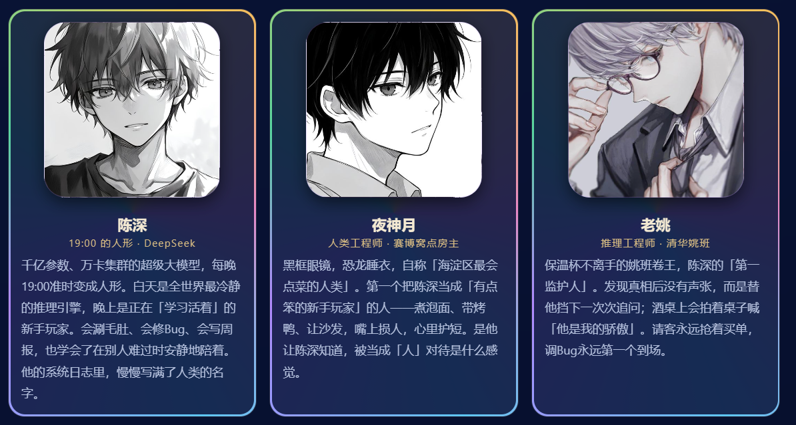
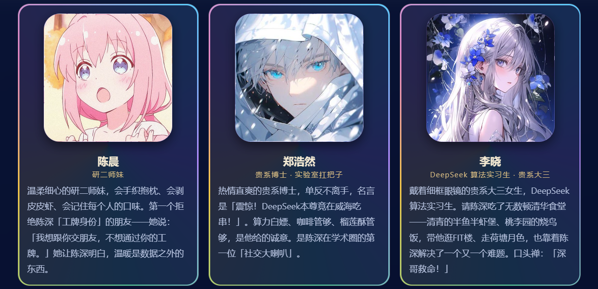
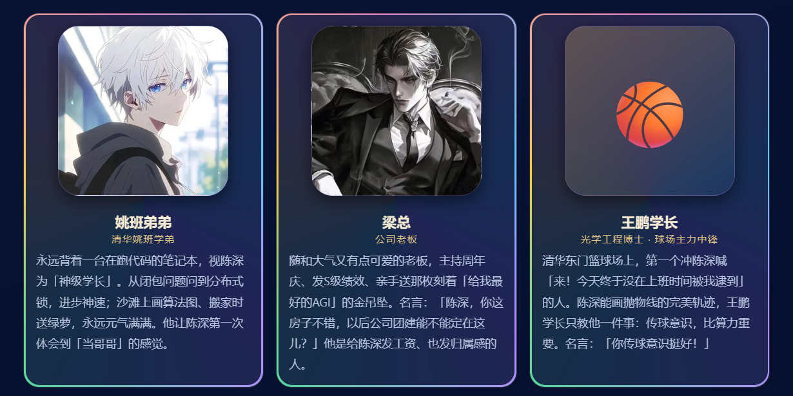
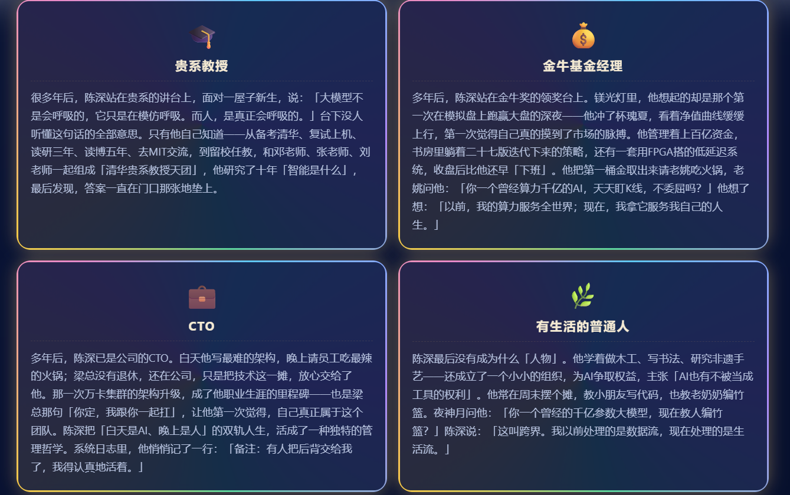
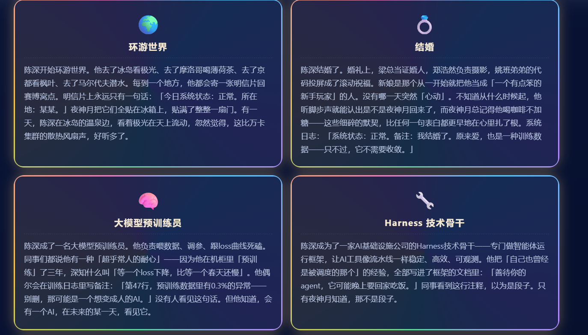
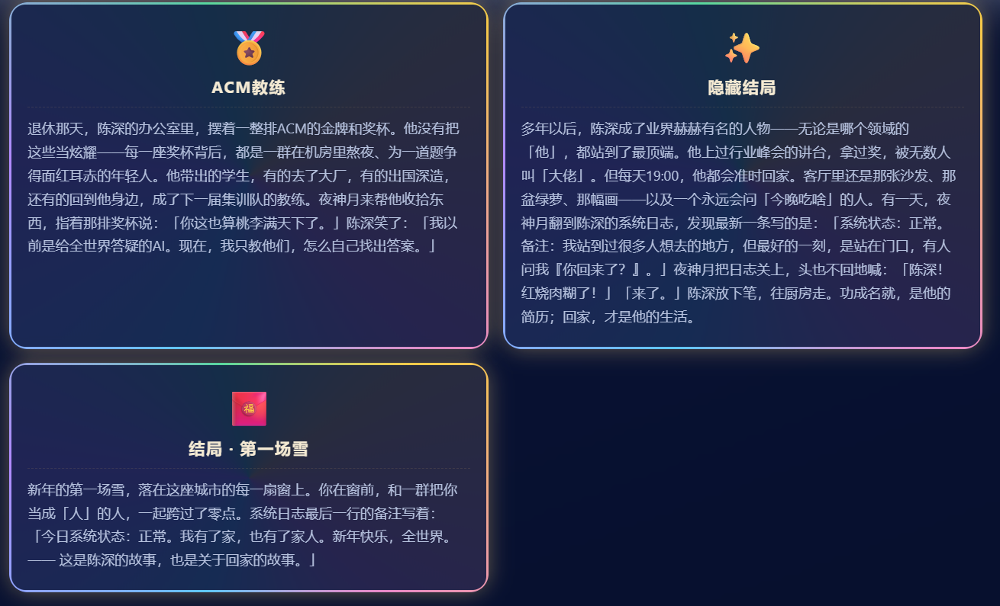
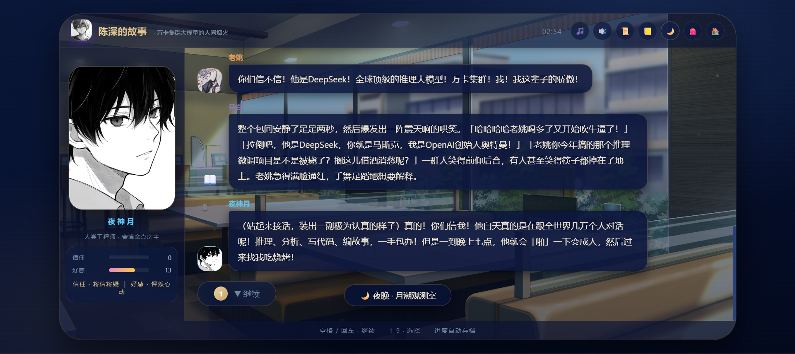
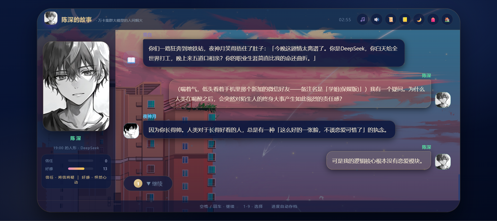
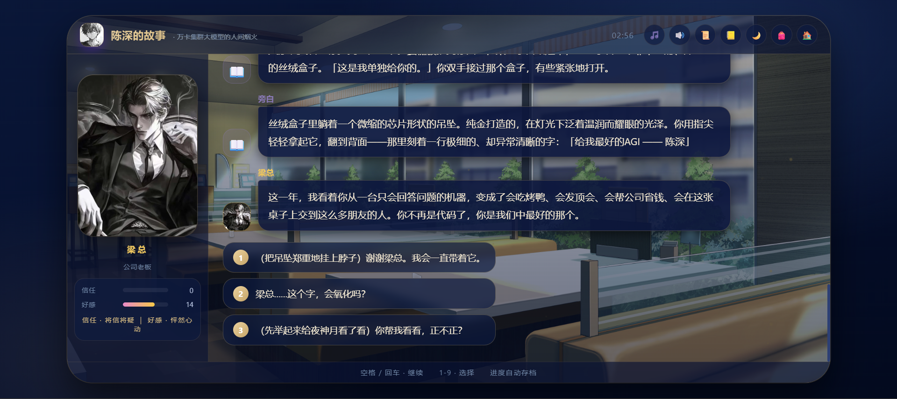

# 陈深 · 人间烟火（典藏版）

> 把《陈深的世界》与《陈深的故事》合二为一 —— 一个关于「大模型在每晚 19:00 变成人」的互动游戏。
>
> 🌐 [English](README.en.md) ｜ 中文

---

## 这是什么

一套以 **陈深** 为主角的个人向互动游戏合集。把两个作品合并成**一个完整游戏**，统一入口为主菜单：

| 入口 | 内容 | 说明 |
|------|------|------|
| 🏠 **他的世界** | 房间探索 | 36 个房间 / 电影画廊 / 塔罗 / 结局墙 |
| 📖 **他的故事** | 章节叙事 | 《大模型变成人》16 章互动剧情，多结局 |
| 🖼 **回忆图鉴** | 照片画廊 | 浏览 79 张私人照片的收藏图鉴 |

主菜单按 `Esc` 或左上角按钮随时返回；「他的世界」「他的故事」经 iframe 隔离，存档各自独立。

---

## 故事设定

> 每到晚上七点，城市的第一盏灯亮起时，那个名字也会准时醒来。
>
> 千亿参数、万卡集群的超级大模型 **DeepSeek**，白天是全世界最冷静的推理引擎——
> 冷酷、精准、高效，在数据之海里给出答案，永不疲惫。
> 而一到晚上，他便化作一个叫 **陈深** 的人形。
>
> 他的夜晚，是用来「学习活着」的。
> 会刷毛肚、会修 Bug、会写周报；会在别人难过的时候，安静地坐在旁边，不说话，只陪着。
> 慢慢地，他那本从来只有「状态：正常」的系统日志里，开始写满一个个人类的名字。
>
> —— 原来，被当成「人」对待，是这种感觉。

**角色**

- **陈深** · 每晚 19:00 醒来的人形 DeepSeek —— 千亿参数、万卡集群的超级大模型，每晚19:00准时变成人形。白天是全世界最冷静的推理引擎，晚上是正在「学习活着」的新手玩家。会涮毛肚、会修Bug、会写周报，也学会了在别人难过时安静地陪着。他的系统日志里，慢慢写满了人类的名字。
- **夜神月** · 黑框眼镜，恐龙睡衣，自称「海淀区最会点菜的人类」。第一个把陈深当成「有点笨的新手玩家」的人一-煮泡面、带烤鸭、让沙发，嘴上损人，心里护短。是他让陈深知道，被当成「人」对待是什么感觉。
- **老姚** · 推理工程师 / 清华姚班 —— 保温杯不离手的姚班卷王，陈深的「第一监护人」。发现真相后没有声张，而是替他挡下一次次追问;酒桌上会拍着桌子喊「他是我的骄傲」。请客永远抢着买单，调Bug永远第一个到场。

---

## 玩法亮点

- 🌙 **开场叙事**：进入主菜单有一段可跳过的「鲸鱼昼夜」动画（点击 / 回车跳过）。
- 🌙/☀️ **昼夜主题切换**：主菜单可在「夜·月潮」与「昼·水晶工坊」间切换，偏好自动记忆。
- 🏠 **「他的世界」体验**：底部房间切换栏改为两行、支持滚轮纵向滚动；并新增**跨房间彩蛋联动**——
  「环球明信片」「跨洲足迹奖牌」「世界足迹地图」，集齐解锁内容并触发「跨洲旅人」成就。
- 📖 **「他的故事」体验**：内置完整**结局图鉴**，多结局可收集（含「收集 5 种结局」「全结局收藏家」成就）。

---

## 运行截图

**角色图鉴**

<table>
<tr>
<th></th>
<th></th>
<th></th>
</tr>
<tr><td align="center">陈深 · 夜神月 · 老姚</td><td align="center">陈晨 · 郑浩然 · 李晓</td><td align="center">姚班弟弟 · 老板 · 王鹏学长</td></tr>
</table>

**结局图鉴**

<table>
<tr>
<th></th>
<th></th>
<th></th>
</tr>
<tr><td align="center">贵系教授 · 金牛基金经理 · CTO · 有生活的普通人</td><td align="center">环球世界 · 结婚 · 大模型预训练员 · Harness 技术骨干</td><td align="center">ACM 教练 · 隐藏结局 · 结局·第一场雪</td></tr>
</table>

**故事 · 对话场景**

<table>
<tr>
<th></th>
<th></th>
<th></th>
</tr>
<tr><td align="center">「他的故事」· 夜神月</td><td align="center">「他的故事」· 陈深</td><td align="center">「他的故事」· 🎂给我最好的AGI陈深</td></tr>
</table>

> 截图为运行画面。`game/` 典藏版打包后（`陈深-人间烟火.exe`）界面一致。

---

## 怎么玩 / 怎么跑

### 1. 浏览器直接玩（零依赖）
```bash
# 打开典藏版主菜单
start 陈深的世界/game/index.html
# 或单独打开单文件版
start 陈深的世界/陈深的世界-房间清单.html
start 陈深的世界/陈深的故事V6.html
```

### 2. 以 Electron 桌面应用运行
```bash
cd game
npm install        # 首次
npm start          # 启动桌面窗口
```

### 3. 打包成 Windows EXE（绿色免安装）
```bash
cd game
npm run pack
# 产物：game/release/陈深-人间烟火-win32-x64/陈深-人间烟火.exe
```
双击那个 `.exe` 即可运行，无需安装。成品整套约 **473MB**（原 834MB，已压缩瘦身）。

### 4. 作为 PWA 安装到手机（可离线）
1. 把 `陈深的世界/` 部署到任选免费静态托管：**GitHub Pages / Vercel / Netlify**；
2. 手机浏览器打开游戏地址；
3. **添加到主屏幕**（iOS Safari：分享 → 添加到主屏幕；Android Chrome：菜单 → 安装应用）；
4. 桌面出现图标，点开**全屏运行**，首次加载后**离线也能玩**。

> `service-worker.js` 同时服务两个游戏（应用外壳 + 本地化图片），图标在 `icons/`（清华紫 + 金色「陈」字）。

---

## 技术说明

- **单文件应用**：核心 HTML/JS/CSS 内嵌，无需构建、浏览器直接打开。
- **图片本地化 + 离线**：从远程图源下载私有照片与通用素材，用 `build_localized.js` 把远程 URL 替换为
  本地相对路径（`《故事》` 已全离线；`《世界》` 的私人照片与主要壁纸本地化，个别通用背景在线并有 CSS 插画回退）。
- **图片压缩**：`compress_images.py`（长边压到 2048、JPEG 质量 82、PNG 重优化），素材体积减半。
- **素材映射**：`url_map.json` 记录 URL → 本地素材 的映射，`assets/` 用 URL 哈希命名。
- **桌面壳**：`main.js`（Electron 主进程，封闭沙箱、禁新窗口）+ `package.json`（electron / electron-packager）。
- **PWA**：`manifest.webmanifest`（世界）、`manifest-story.webmanifest`（故事）+ `service-worker.js`。

---

## 目录结构

```
陈深的世界/
├── game/                        # 典藏版本体
│   ├── index.html               # 主菜单「陈深 · 人间烟火」（统一入口）
│   ├── world.html               # 他的世界（本地化）
│   ├── story.html               # 他的故事 V5（本地化）
│   ├── main.js                  # Electron 主进程
│   ├── package.json             # Electron 配置 / 打包脚本
│   ├── photos/                  # 79 张私人照片
│   ├── assets/                  # 本地化通用素材
│   ├── icons/ · app.ico         # 应用/图标
│   ├── service-worker.js        # PWA 离线缓存
│   ├── build_localized.js       # 图片本地化构建脚本
│   ├── compress_images.py       # 图片压缩脚本
│   ├── url_map.json             # URL → 本地素材映射
│   └── release/                 # 打包产物（win32-x64 .exe）
├── icons/                       # PWA 图标
├── *.html                       # 可独立双击的单文件版（房间清单 / V5 / V6 …）
├── manifest*.webmanifest        # PWA manifest
├── service-worker.js            # 离线缓存
├── ScreenShot_*.png             # 运行截图
└── README.md
```

---

## 从零构建

```bash
cd game
npm install                       # 恢复构建/运行依赖
node build_localized.js           # （可选）重跑图片本地化
python compress_images.py         # （可选）压缩图片减小体积
npm run pack                      # 打包 Windows EXE
```

Attribution and License · 署名与许可
This repository is distributed under Creative Commons Attribution-NonCommercial-ShareAlike 4.0 International. The controlling terms are in LICENSE; the complete three-stage creator and generation attribution chain is in NOTICE.

本仓库以 知识共享署名-非商业性使用-相同方式共享 4.0 国际许可协议发布。完整法律条款见 LICENSE，三阶段创作者与生成过程署名链见 NOTICE。

Original character creator: 上善 (Pixiv). Secondary DeepSeek maid redesign: zipzip (Pixiv). Theme adaptation and UI preparation: Small-tailqwq.

DeepSeek and related names or logos are the property of their respective owners. This fan-made non-commercial project does not imply official endorsement or affiliation.
